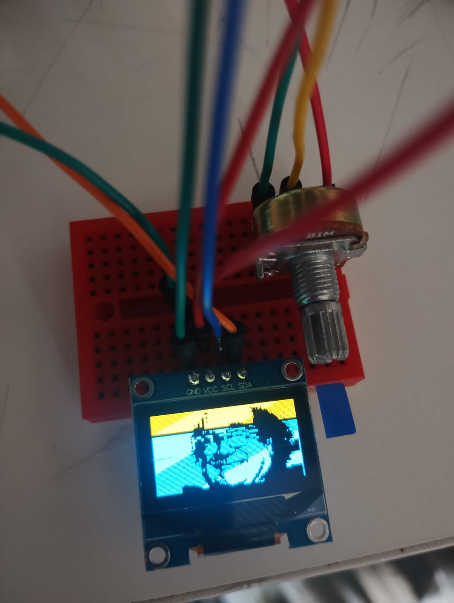

# sesion-04a

Probando texto que alterna imagen

En este caso hice a Danny DeVitto comiendo doritos, lo que abre la puerta a hacer lo que quiera y tenerlo en display de fondo.

Con más ram me gustaría hacer animaciones.

```cpp
#include <Wire.h>
#include <Adafruit_GFX.h> //"usa las bibliotecas ya instaladas"
#include <Adafruit_SSD1306.h>

#define SCREEN_WIDTH 128    //parámetros de pantalla
#define SCREEN_HEIGHT 64
#define OLED_RESET -1
Adafruit_SSD1306 pantallita(SCREEN_WIDTH, SCREEN_HEIGHT, &Wire, OLED_RESET);  //"que es pantallita"

int contador = 0;   //inicia en 0

// 'story-behind-this-picture-v0-b90o0o7vy24d1', 128x64px //nombre imagen/dimensiones
const unsigned char deVitto [] PROGMEM = {
 0xff, 0xff, 0xff, 0xf8, 0x00, 0x00, 0x00, 0x00, 0x00, 0x00, 0x00, 0x00, 0x1f, 0xff, 0xff, 0xff, 
 0xff, 0xff, 0xff, 0xf8, 0x00, 0x00, 0x00, 0x00, 0x00, 0x00, 0x00, 0x00, 0x1f, 0xff, 0xff, 0xff, 
 0xff, 0xff, 0xff, 0xf8, 0x00, 0x00, 0x00, 0x00, 0x00, 0x00, 0x00, 0x00, 0x1f, 0xff, 0xff, 0xff, 
 0xff, 0xff, 0xff, 0xf8, 0x00, 0x00, 0x00, 0x00, 0x00, 0x00, 0x00, 0x00, 0x1f, 0xff, 0xff, 0xff, 
 0xff, 0xff, 0xff, 0xf8, 0x00, 0x00, 0x00, 0x00, 0x00, 0x00, 0x00, 0x00, 0x1f, 0xff, 0xff, 0xff, 
 0xff, 0xff, 0xff, 0xf8, 0x00, 0x00, 0x00, 0x00, 0x00, 0x00, 0x00, 0x00, 0x1f, 0xff, 0xff, 0xff, 
 0xff, 0xff, 0xff, 0xf8, 0x00, 0x00, 0x00, 0x00, 0x00, 0x00, 0x00, 0x00, 0x1f, 0xff, 0xff, 0xff, 
 0xff, 0xff, 0xff, 0xf8, 0x00, 0x00, 0x00, 0x00, 0x00, 0x00, 0x00, 0x00, 0x1f, 0xff, 0xff, 0xff, 
 0xff, 0xff, 0xff, 0xf8, 0x00, 0x00, 0x00, 0x00, 0x00, 0x00, 0x00, 0x00, 0x1f, 0xff, 0xff, 0xff, 
 0xff, 0xff, 0xff, 0xf8, 0x00, 0x00, 0x00, 0x00, 0x00, 0x00, 0x00, 0x00, 0x1f, 0xff, 0xff, 0xff, 
 0xff, 0xff, 0xff, 0xf8, 0x00, 0x00, 0x00, 0x00, 0x00, 0x00, 0x00, 0x00, 0x1f, 0xff, 0xff, 0xff, 
 0xff, 0xff, 0xff, 0xf8, 0x00, 0x00, 0x00, 0x00, 0x00, 0x00, 0x00, 0x00, 0x1f, 0xff, 0xff, 0xff, 
 0xff, 0xff, 0xff, 0xf8, 0x00, 0x00, 0x00, 0x00, 0x00, 0x00, 0x00, 0x00, 0x1f, 0xff, 0xff, 0xff, 
 0xff, 0xff, 0xff, 0xf8, 0x00, 0x00, 0x00, 0x00, 0x00, 0x00, 0x00, 0x00, 0x1f, 0xff, 0xff, 0xff, 
 0xff, 0xff, 0xff, 0xf8, 0x00, 0x00, 0x00, 0x00, 0x00, 0x00, 0x00, 0x00, 0x1f, 0xff, 0xff, 0xff, 
 0xff, 0xff, 0xff, 0xf8, 0x00, 0x00, 0x00, 0x00, 0x00, 0x00, 0x00, 0x00, 0x1f, 0xff, 0xff, 0xff, 
 0xff, 0xff, 0xff, 0xf8, 0x00, 0x00, 0x00, 0x00, 0x00, 0x00, 0x00, 0x00, 0x1f, 0xff, 0xff, 0xff, 
 0xff, 0xff, 0xff, 0xf8, 0x00, 0x00, 0x00, 0x0f, 0xc0, 0x00, 0x00, 0x00, 0x1f, 0xff, 0xff, 0xff, 
 0xff, 0xff, 0xff, 0xf8, 0x00, 0x00, 0x00, 0x1f, 0xe0, 0x00, 0x00, 0x00, 0x1f, 0xff, 0xff, 0xff, 
 0xff, 0xff, 0xff, 0xf8, 0x00, 0x00, 0x00, 0x3f, 0xe0, 0x00, 0x00, 0x00, 0x1f, 0xff, 0xff, 0xff, 
 0xff, 0xff, 0xff, 0xf8, 0x00, 0x00, 0x00, 0x3f, 0xf0, 0x00, 0x00, 0x00, 0x1f, 0xff, 0xff, 0xff, 
 0xff, 0xff, 0xff, 0xf8, 0x00, 0x00, 0x00, 0x6f, 0xf0, 0x00, 0x00, 0x00, 0x1f, 0xff, 0xff, 0xff, 
 0xff, 0xff, 0xff, 0xf8, 0x00, 0x00, 0x00, 0x27, 0xf0, 0x00, 0x00, 0x00, 0x1f, 0xff, 0xff, 0xff, 
 0xff, 0xff, 0xff, 0xf8, 0x00, 0x00, 0x00, 0x31, 0xd0, 0x00, 0x00, 0x00, 0x1f, 0xff, 0xff, 0xff, 
 0xff, 0xff, 0xff, 0xf8, 0x00, 0x00, 0x00, 0x1b, 0xd0, 0x00, 0x00, 0x00, 0x1f, 0xff, 0xff, 0xff, 
 0xff, 0xff, 0xff, 0xf8, 0x00, 0x00, 0x00, 0x1f, 0xf0, 0x00, 0x00, 0x00, 0x1f, 0xff, 0xff, 0xff, 
 0xff, 0xff, 0xff, 0xf8, 0x00, 0x00, 0x00, 0x1f, 0xf0, 0x00, 0x00, 0x00, 0x1f, 0xff, 0xff, 0xff, 
 0xff, 0xff, 0xff, 0xf8, 0x00, 0x00, 0x00, 0x0f, 0xf0, 0x00, 0x00, 0x00, 0x1f, 0xff, 0xff, 0xff, 
 0xff, 0xff, 0xff, 0xf8, 0x00, 0x00, 0x00, 0x07, 0xe0, 0x00, 0x00, 0x00, 0x1f, 0xff, 0xff, 0xff, 
 0xff, 0xff, 0xff, 0xf8, 0x00, 0x00, 0x00, 0x07, 0xc0, 0x00, 0x00, 0x00, 0x1f, 0xff, 0xff, 0xff, 
 0xff, 0xff, 0xff, 0xf8, 0x00, 0x00, 0x00, 0x3f, 0xc0, 0x00, 0x00, 0x00, 0x1f, 0xff, 0xff, 0xff, 
 0xff, 0xff, 0xff, 0xf8, 0x00, 0x00, 0x00, 0xff, 0xc1, 0x00, 0x00, 0x00, 0x1f, 0xff, 0xff, 0xff, 
 0xff, 0xff, 0xff, 0xf8, 0x00, 0x00, 0x0f, 0xff, 0x83, 0xc0, 0x00, 0x00, 0x1f, 0xff, 0xff, 0xff, 
 0xff, 0xff, 0xff, 0xf8, 0x00, 0x00, 0x3f, 0xf9, 0x03, 0xc0, 0x00, 0x00, 0x1f, 0xff, 0xff, 0xff, 
 0xff, 0xff, 0xff, 0xf8, 0x00, 0x00, 0x3f, 0x80, 0x10, 0x00, 0x00, 0x00, 0x1f, 0xff, 0xff, 0xff, 
 0xff, 0xff, 0xff, 0xf8, 0x00, 0x00, 0x3e, 0x00, 0x78, 0x00, 0x00, 0x00, 0x1f, 0xff, 0xff, 0xff, 
 0xff, 0xff, 0xff, 0xf8, 0x00, 0x00, 0x38, 0x00, 0x38, 0x00, 0x00, 0x00, 0x1f, 0xff, 0xff, 0xff, 
 0xff, 0xff, 0xff, 0xf8, 0x00, 0x00, 0x00, 0x02, 0x38, 0x00, 0x00, 0x00, 0x1f, 0xff, 0xff, 0xff, 
 0xff, 0xff, 0xff, 0xf8, 0x00, 0x00, 0x00, 0x00, 0x10, 0x00, 0x00, 0x00, 0x1f, 0xff, 0xff, 0xff, 
 0xff, 0xff, 0xff, 0xf8, 0x00, 0x00, 0x00, 0x00, 0x10, 0x00, 0x00, 0x00, 0x1f, 0xff, 0xff, 0xff, 
 0xff, 0xff, 0xff, 0xf8, 0x00, 0x00, 0x00, 0x00, 0x31, 0xf0, 0x00, 0x00, 0x1f, 0xff, 0xff, 0xff, 
 0xff, 0xff, 0xff, 0xf8, 0x00, 0x00, 0x00, 0x30, 0x3f, 0xf0, 0x00, 0x00, 0x1f, 0xff, 0xff, 0xff, 
 0xff, 0xff, 0xff, 0xf8, 0x00, 0x00, 0x00, 0x38, 0x3c, 0x00, 0x00, 0x00, 0x1f, 0xff, 0xff, 0xff, 
 0xff, 0xff, 0xff, 0xf8, 0x00, 0x00, 0x00, 0x30, 0x1c, 0x38, 0x00, 0x00, 0x1f, 0xff, 0xff, 0xff, 
 0xff, 0xff, 0xff, 0xf8, 0x00, 0x00, 0x00, 0x10, 0x0c, 0x30, 0x00, 0x00, 0x1f, 0xff, 0xff, 0xff, 
 0xff, 0xff, 0xff, 0xf8, 0x00, 0x00, 0x00, 0x00, 0x0c, 0x00, 0x00, 0x00, 0x1f, 0xff, 0xff, 0xff, 
 0xff, 0xff, 0xff, 0xf8, 0x00, 0x00, 0x00, 0x00, 0x0e, 0x60, 0x00, 0x00, 0x1f, 0xff, 0xff, 0xff, 
 0xff, 0xff, 0xff, 0xf8, 0x00, 0x00, 0x00, 0x00, 0x07, 0xf8, 0x00, 0x00, 0x1f, 0xff, 0xff, 0xff, 
 0xff, 0xff, 0xff, 0xf8, 0x00, 0x00, 0x07, 0x00, 0x03, 0xf8, 0x00, 0x00, 0x1f, 0xff, 0xff, 0xff, 
 0xff, 0xff, 0xff, 0xf8, 0x00, 0x00, 0x0f, 0x00, 0x01, 0xd8, 0x00, 0x00, 0x1f, 0xff, 0xff, 0xff, 
 0xff, 0xff, 0xff, 0xf8, 0x00, 0x00, 0x0f, 0x00, 0x00, 0xd0, 0x00, 0x00, 0x1f, 0xff, 0xff, 0xff, 
 0xff, 0xff, 0xff, 0xf8, 0x00, 0x00, 0x0f, 0x00, 0x00, 0x00, 0x00, 0x00, 0x1f, 0xff, 0xff, 0xff, 
 0xff, 0xff, 0xff, 0xf8, 0x00, 0x00, 0x0f, 0x00, 0x00, 0x00, 0x00, 0x00, 0x1f, 0xff, 0xff, 0xff, 
 0xff, 0xff, 0xff, 0xf8, 0x00, 0x00, 0x0f, 0x00, 0x00, 0x00, 0x00, 0x00, 0x1f, 0xff, 0xff, 0xff, 
 0xff, 0xff, 0xff, 0xf8, 0x00, 0x00, 0x07, 0x00, 0x00, 0x00, 0x00, 0x00, 0x1f, 0xff, 0xff, 0xff, 
 0xff, 0xff, 0xff, 0xf8, 0x00, 0x00, 0x07, 0x00, 0x00, 0x00, 0x00, 0x00, 0x1f, 0xff, 0xff, 0xff, 
 0xff, 0xff, 0xff, 0xf8, 0x00, 0x00, 0x07, 0x00, 0x00, 0x00, 0x00, 0x00, 0x1f, 0xff, 0xff, 0xff, 
 0xff, 0xff, 0xff, 0xf8, 0x00, 0x00, 0x07, 0x00, 0x00, 0x00, 0x00, 0x00, 0x1f, 0xff, 0xff, 0xff, 
 0xff, 0xff, 0xff, 0xf8, 0x00, 0x00, 0x03, 0x00, 0x00, 0x00, 0x00, 0x00, 0x1f, 0xff, 0xff, 0xff, 
 0xff, 0xff, 0xff, 0xf8, 0x00, 0x00, 0x00, 0x00, 0x00, 0x00, 0x00, 0x00, 0x1f, 0xff, 0xff, 0xff, 
 0xff, 0xff, 0xff, 0xf8, 0x00, 0x00, 0x00, 0x00, 0x00, 0x00, 0x00, 0x00, 0x1f, 0xff, 0xff, 0xff, 
 0xff, 0xff, 0xff, 0xf8, 0x00, 0x00, 0x00, 0x00, 0x00, 0x00, 0x00, 0x00, 0x1f, 0xff, 0xff, 0xff, 
 0xff, 0xff, 0xff, 0xf8, 0x00, 0x00, 0x00, 0x00, 0x00, 0x00, 0x00, 0x00, 0x1f, 0xff, 0xff, 0xff, 
 0xff, 0xff, 0xff, 0xf8, 0x00, 0x00, 0x00, 0x00, 0x00, 0x00, 0x00, 0x00, 0x1f, 0xff, 0xff, 0xff
};


void setup() {
  if(!pantallita.begin(SSD1306_SWITCHCAPVCC, 0x3C)) {     //si no inicia actividad
    Serial.println(F("No se encontró la pantalla SSD1306"));  //en caso de que no funcione
    for(;;); 
  }
  pantallita.clearDisplay();
  pantallita.setTextColor(SSD1306_WHITE);
}

void loop() {
  pantallita.clearDisplay(); // Borra la pantalla
  pantallita.drawBitmap(0, 0, deVitto, 128, 64, WHITE); //dibuja en bitmap/desde arriba a la izquierda/la imagen específica/ancho/alto/en color blanco

  pantallita.display(); // Actualiza la pantalla
  contador++;
  delay(1000);
  pantallita.clearDisplay();

  pantallita.setTextSize(2);    //reproducción de más texto pero en loop
  pantallita.setTextColor(WHITE);  //color
  pantallita.setCursor(0, 0);   //ubicación
  pantallita.println("mmmmmm");  //texto
  pantallita.println("Doritos");  //salta una línea

  pantallita.display();   //muestra lo que es pantallita
  delay(1300);    //1.3 segundos
  pantallita.clearDisplay();   //borra pantalla
}
```



PD: Logré hacer las mañanitas.

Aquí está la versión en donde mejoro el ritmo y varío el tamaño de fuente. Lo siguiente podría ser añadir scroll.

```cpp
//Mananitas

#include <Wire.h>
#include <Adafruit_SSD1306.h>
#include <Adafruit_GFX.h>

#define OLED_WIDTH 128
#define OLED_HEIGHT 64

#define OLED_ADDR   0x3C

Adafruit_SSD1306 display(OLED_WIDTH, OLED_HEIGHT);

void setup() {
  display.begin(SSD1306_SWITCHCAPVCC, OLED_ADDR);
  display.clearDisplay();

  display.setTextSize(1);
  display.setTextColor(WHITE);
  display.setCursor(0, 0);
  display.println("A continuación");
  display.println("Las mananitas");

  display.display();

  delay(4000);
}

void loop() {
  display.clearDisplay();    //limpiar pantalla

  display.setTextSize(2);    //reproducción de más texto pero en loop
  display.setTextColor(WHITE); 
  display.setCursor(0, 0);
  display.println("Estas son");
  display.println("las mananitas");

  display.display();
  delay(1500);
  display.clearDisplay();

  
  display.setTextSize(2);    //reproducción de más texto pero en loop
  display.setTextColor(WHITE); 
  display.setCursor(0, 17);
  display.println("Que");
  display.println("cantaba");
  display.println("el rey");

  display.display();
  delay(1600);
  display.clearDisplay();

  display.setTextSize(3);    //reproducción de más texto pero en loop
  display.setTextColor(WHITE); 
  display.setCursor(0, 0);
  display.println("David");

  display.display();
  delay(1100);
  display.clearDisplay();

  display.setTextSize(1);    //reproducción de más texto pero en loop
  display.setTextColor(WHITE); 
  display.setCursor(0, 17);
  display.println("Hoy, por ser día");

  display.display();
  delay(1700);
  display.clearDisplay();

  display.setTextSize(2);    //reproducción de más texto pero en loop
  display.setTextColor(WHITE); 
  display.setCursor(0, 1);
  display.println("de tu");
  display.println("santo");

  display.display();
  delay(1300);
  display.clearDisplay();

  display.setTextSize(1);    //reproducción de más texto pero en loop
  display.setTextColor(WHITE); 
  display.setCursor(0, 17);
  display.println("Te las cantamos");

  display.display();
  delay(1500);
  display.clearDisplay();

  display.setTextSize(5);    //reproducción de más texto pero en loop
  display.setTextColor(WHITE); 
  display.setCursor(0, 0);
  display.println("Aqui");

  display.display();
  delay(3000);
  display.clearDisplay();
}
```

## IDEAS ENTREGA POEMA

El plan es tener una conversación con arduino usando la pantalla, el monitor serial y el potenciómetro. Se mostrarán preguntas o planteamientos
que instarán al usuario a tomar una decisión mediante el movimiento de la perilla. Según el sentido al que esta apunte se tomará uno de 2 (o más) caminos
revelando un poema pertinente. Buscamos un tono cómico pero reflexivo. También consideramos el uso de imágenes para dar un ritmo y separar los textos en pantalla.

## PREGUNTAS Y RESPUESTAS

Las preguntas deben ser introspectivas y capaces de generar una resonancia con los poemas que se mostratán en el resultado. Las respuestas por otra parte deberán ser cortas,
rápidas y polarizadas para poder hacer una distinción más evidente. No habrán respuestas correctas, eso lo dejaremos a discreción del usuario. Ademas de la retroalimentación
en forma de poema se mostrará una imagen en la pantalla OLED que "reaccione" a la respuesta y refuerce el tono de dicho poema.

## HUMORÍSTICAS

¿Qué le echas primero al completo?

¿Prefieres perros o gatos?

¿Prefieres tener paz o tener la razón?

¿Te mueve más la curiosidad o la costumbre?

¿El huevo o la gallina?

## DE CARÁCTER

¿Qué te hace sentir más vivo?

¿Cuándo fuiste hipócrita? Hoy/ayer/mañana

¿Qué parte de ti se miente? Autopercepción

¿Tu defecto favorito?

¿Qué valoras por encima de todo?

¿Qué atesoras?

¿Qué te haría sentir completo?

¿Qué sientes cuando nadie te ve?

¿Qué te hace diferente?

## POEMAS

Los poemas deben ser breves hasta cierto punto y tratar un tema en específico, aunque de manera no literal. Deben hacer que el usuario les encuentre sentido.
Idealmente tienen un elemento característico que se pueda graficar y lo una con las preguntas y respuestas. Otra opción es hacer una secuencia de poemas del mismo autor
para darle valor agregado y elevar el proyecto a un cuestionario. Otra razón para la brevedad de los poemas es el limitado espacio. Para no tener que discriminar
los poemas por su extensión podríamos usar párrafos específicos.

## OPCIONES

<https://circulodepoesia.com/2021/08/poemas-de-julio-cortazar/> <https://psicologiaymente.com/cultura/poemas-julio-cortazar>
Elegimos a Julio Cortazar para revisar sus obras reconociendo temas específicos para emparejarlos con las preguntas. A continuación hay algunos de ellos:

1.Encargo-Amor, culpa y castigo

2.Para leer en forma interrogativa-Introspección y duda

3.Le Dôme-realidad, desamor y desencanto

4.La edad del amor-amor e intensidad

5.Cartel-extrospección y admiración

6.Después de las fiestas-amor e intimidad

Después de esta breve recopilación y análisis es posible emparejar los poemas. Hay 2 maneras de abordarlo: opuestos o variables. Tomando como ejemplo los
poemas que tratan el amor podemos definir caminos distintos según el tipo de amor del que hablan o oponerlo a un poema con desamor. ¿Podría ser ambas opciones?
En caso de tener estas 3 opciones sería un poco más dificil polarizar los caminos pero se podría aprovechar de mejor manera el potenciador.

## RECORRIDO (inicial)

La interacción inicia haciendo una pregunta a través de la pantalla y dando 10 segundos para responderla por medio del potenciómetro. La elección entre una de las 2 opciones
llevará al usuario a otra pregunta distinta y dependiente de la pregunta anterior. Al responder esta 2da pregunta se reproducirá un poema variable y pertinente a la respuesta recibida.
En total habrán 3 preguntas, 6 respuestas y 2 poemas ya que ambas preguntas secundarias ofrecerán el mismo par de poemas como resultado.

## RE_PLANTEAMIENTO

A medida que avanzamos en la planificación del proyecto nos dimos cuenta de dificultades que podríamos encontrar en el camino. La ramificación de las preguntas y respuestas
se puede simplificar a una distribución lineal para evitar errores y mantener el efecto deseado. Consideramos la opción de tener más preguntas y almacenar las respuestas
para devolver un poema. De esta manera se puede interactuar más con el mínimo sacrificio de los "caminos" según respuesta.

## MÁS OPCIONES

<http://amediavoz.com/cortazar.htm#A%20UNA%20MUJER> <https://www.revistaaltazor.cl/julio-cortazar/> <https://www.poemas-del-alma.com/julio-cortazar-te-amo-por-ceja.htm>

7.Los amantes-Amor, inclemencia y cotidianeidad

8.La mas querida-Amor, amargura

9.Siempre empezó a llover…-Desamor, fallo y desgracia

10.Una carta de amor-Enamoramiento, apreciación

11.Te amo por ceja-Amor, devoción y expectativa

12.Tala-Amor, añoranza y entrega

13.El futuro-Remembranza, nostalgia

14.Happy New year-Amor, conquista

Nuestro proyecto busca satisfacer la necesidad de conexión humana de manera indirecta pero genuina. Por eso el tema principal de los poemas es el amor y los aspectos que lo acompañan. Para poder unirlos todos los poemas serán del mismo autor, ofreciendo tonos de dulzura, amargura y desamor provenientes de la misma persona. Después de esta recopilación será necesario formular las preguntas, definir respuestas de una palabra y seleccionar los versos por usar.

Para hacer display de las respuestas mostraremos una imagen mitad blanco/mitad negro con ambas opciones. Cada opción será de una palabra y serán idealmente opuestas entre si.

## 3 PREGUNTAS

Deben ser sobre el amor (tema principal de los poemas) e ir aumentando gradualmente en intensidad. Idealmente la primera es general o humorística para relajar al usuario, la segunda es más intensa
y la tercera indaga sobre temas personales. Lo complicado de las preguntas es que deben generar perfiles distintos usando todas las variables posibles (2x2x2=8 pero usaremos 7)
asi que deben estar muy en sintonía con los poemas.

1ra

-¿Prefieres tener paz o tener la razón?
-¿Prefieres pedir perdón o permiso?
-¿Tangananica o Tanganana?

2da

-¿Qué te haría sentir completo? propósito/amor
-¿Te sientes culpable?
-¿Te has enamorado?

3ra

-¿Crees en las almas gemelas?
-¿Que te llama más la atención de estar en pareja? compañía/seguridad
-¿Qué te quita el sueño? miedo/incertidumbre

## 7 POEMAS

1.La edad del amor/ Pasión

Si los leones fueran rojos
si en mitad del pecho se les viera latiendo un corazón de ágata
sería un poco lo que entre mis brazos
nace de tu violenta pesadilla.

2.Cartel/ Tranquilidad solitaria

Veo el mundo como un caos y en el centro una rosa
veo la rosa como el ojo feliz de la hermosura y en su centro el gusano
veo el gusano como un fragmento de la inmensa vida y en su centro la muerte

3.Happy New Year/ Añoranza y búsqueda de amor

Mira, no pido mucho, solamente tu mano,
tenerla como un sapito que duerme así contento.
Necesito esa puerta que me dabas para entrar a tu mundo, e
se trocito de azúcar verde, de redondo alegre.

4.Después de las fiestas/ Certeza

eras la que no se iba porque una misma almohada
y una misma tibieza iba a llamarnos otra vez a despertar al nuevo día,
 juntos, riendo, despeinados.

5.La lenta máquina del desamor/ Desamor

de pie ante el espejo interrogándose cada uno a sí mismo,
ya no mirándose entre ellos,
ya no desnudos para el otro,
ya no te amo, mi amor.

7.After such pleasures/ Vacío

Solo en mi casa abierta sobre el puerto otra vez empezar a quererte,
otra vez encontrarte en el café de la mañana
sin que tanta cosa irrenunciable hubiera sucedido.

8.Hic Et Nunc/Superación

Mira de qué sustancias vivo,
pero no me tengas lástima, yéndote así
todavía más.

## ESTRUCTURA TEXTO

Buscando mantener la simpleza optamos por preguntas generales con respuestas sencillas de entre las opciones anteriores. Aunque parcen muy parecidas, la falta o adición de una de las 3 variables hacen la diferencia. Por ejemplo: si dicen que se han enamorado pero no creen en almas gemelas, es posible que les toque el poema que trata el desamor. Al ser imágenes de texto optamos por añadir una respuesta con íconos para reforzar el tema del amor.

1-¿Te has enamorado?

``

2-¿Qué te haría sentir completo? propósito/amor

``

3-¿Crees en las almas gemelas?

``

A continuación hay una versión del código en la que se declaran preguntas, poemas y respuestas pero aun están en proceso de ser integradas a los condicionales.

```cpp
// librerias para funcionamiento de pantallita
#include <Wire.h>
#include <Adafruit_GFX.h>
#include <Adafruit_SSD1306.h>

// denifir el ancho de la pantalla
#define SCREEN_WIDTH 128
// definir el alto d ela pantalla
#define SCREEN_HEIGHT 64
// que se resetee REVISAR REVISAR REVISAR REVISAR REVISAR
#define OLED_RESET -1
Adafruit_SSD1306 pantallita(SCREEN_WIDTH, SCREEN_HEIGHT, &Wire, OLED_RESET);

// imagen de respuestas izquierda: corazón -  derecha: corazón roto
const unsigned char Respuestas1 [] PROGMEM = {
 0x00, 0x00, 0x00, 0x00, 0x00, 0x00, 0x00, 0x00, 0xff, 0xff, 0xff, 0xff, 0xff, 0xff, 0xff, 0xff, 
 0x00, 0x00, 0x00, 0x00, 0x00, 0x00, 0x00, 0x00, 0xff, 0xff, 0xff, 0xff, 0xff, 0xff, 0xff, 0xff, 
 0x00, 0x00, 0x00, 0x00, 0x00, 0x00, 0x00, 0x00, 0xff, 0xff, 0xff, 0xff, 0xff, 0xff, 0xff, 0xff, 
 0x00, 0x00, 0x00, 0x00, 0x00, 0x00, 0x00, 0x00, 0xff, 0xff, 0xff, 0xff, 0xff, 0xff, 0xff, 0xff, 
 0x00, 0x00, 0x00, 0x00, 0x00, 0x00, 0x00, 0x00, 0xff, 0xff, 0xff, 0xff, 0xff, 0xff, 0xff, 0xff, 
 0x00, 0x00, 0x00, 0x00, 0x00, 0x00, 0x00, 0x00, 0xff, 0xff, 0xff, 0xff, 0xff, 0xff, 0xff, 0xff, 
 0x00, 0x00, 0x00, 0x00, 0x00, 0x00, 0x00, 0x00, 0xff, 0xff, 0xff, 0xff, 0xff, 0xff, 0xff, 0xff, 
 0x00, 0x00, 0x00, 0x00, 0x00, 0x00, 0x00, 0x00, 0xff, 0xff, 0xff, 0xff, 0xff, 0xff, 0xff, 0xff, 
 0x00, 0x00, 0x00, 0x00, 0x00, 0x00, 0x00, 0x00, 0xff, 0xff, 0xff, 0xff, 0xff, 0xff, 0xff, 0xff, 
 0x00, 0x00, 0x00, 0x00, 0x00, 0x00, 0x00, 0x00, 0xff, 0xff, 0xff, 0xff, 0xff, 0xff, 0xff, 0xff, 
 0x00, 0x00, 0x00, 0x00, 0x00, 0x00, 0x00, 0x00, 0xff, 0xff, 0xff, 0xff, 0xff, 0xff, 0xff, 0xff, 
 0x00, 0x00, 0x00, 0x00, 0x00, 0x00, 0x00, 0x00, 0xff, 0xff, 0xff, 0xff, 0xff, 0xff, 0xff, 0xff, 
 0x00, 0x00, 0x00, 0x00, 0x00, 0x00, 0x00, 0x00, 0xff, 0xff, 0xff, 0xff, 0xff, 0xff, 0xff, 0xff, 
 0x00, 0x00, 0x00, 0x00, 0x00, 0x00, 0x00, 0x00, 0xff, 0xff, 0xff, 0xff, 0xff, 0xff, 0xff, 0xff, 
 0x00, 0x00, 0x00, 0x00, 0x00, 0x00, 0x00, 0x00, 0xff, 0xff, 0xff, 0xff, 0xff, 0xff, 0xff, 0xff, 
 0x00, 0x00, 0x00, 0x00, 0x00, 0x00, 0x00, 0x00, 0xff, 0xff, 0xff, 0xff, 0xff, 0xff, 0xff, 0xff, 
 0x00, 0x00, 0x00, 0x00, 0x00, 0x00, 0x00, 0x00, 0xff, 0xff, 0xff, 0xff, 0xff, 0xff, 0xff, 0xff, 
 0x00, 0x00, 0x00, 0x00, 0x00, 0x00, 0x00, 0x00, 0xff, 0xff, 0xff, 0xff, 0xff, 0xff, 0xff, 0xff, 
 0x00, 0x00, 0x00, 0x00, 0x00, 0x00, 0x00, 0x00, 0xff, 0xff, 0xff, 0xff, 0xff, 0xff, 0xff, 0xff, 
 0x00, 0x00, 0x00, 0x00, 0x00, 0x00, 0x00, 0x00, 0xff, 0xff, 0xff, 0xff, 0xff, 0xff, 0xff, 0xff, 
 0x00, 0x00, 0x00, 0x00, 0x00, 0x00, 0x00, 0x00, 0xff, 0xff, 0xff, 0xff, 0xff, 0xff, 0xff, 0xff, 
 0x00, 0x00, 0x00, 0x00, 0x00, 0x00, 0x00, 0x00, 0xff, 0xff, 0xff, 0xff, 0xff, 0xff, 0xff, 0xff, 
 0x00, 0x00, 0x00, 0x00, 0x00, 0x00, 0x00, 0x00, 0xff, 0xff, 0xff, 0xff, 0xff, 0xff, 0xff, 0xff, 
 0x00, 0x00, 0x00, 0x00, 0x00, 0x00, 0x00, 0x00, 0xff, 0xff, 0xff, 0xff, 0xff, 0xff, 0xff, 0xff, 
 0x00, 0x00, 0x00, 0x00, 0x00, 0x00, 0x00, 0x00, 0xff, 0xff, 0xff, 0xff, 0xff, 0xff, 0xff, 0xff, 
 0x00, 0x00, 0x00, 0x00, 0x00, 0x00, 0x00, 0x00, 0xff, 0xff, 0xff, 0xff, 0xff, 0xff, 0xff, 0xff, 
 0x00, 0x00, 0x00, 0x00, 0x00, 0x00, 0x00, 0x00, 0xff, 0xff, 0xff, 0xff, 0xff, 0xff, 0xff, 0xff, 
 0x00, 0x00, 0x00, 0x00, 0x00, 0x00, 0x00, 0x00, 0xff, 0xff, 0xff, 0xff, 0xff, 0xff, 0xff, 0xff, 
 0x00, 0x00, 0x00, 0x00, 0x00, 0x00, 0x00, 0x00, 0xff, 0xff, 0xff, 0xff, 0xff, 0xff, 0xff, 0xff, 
 0x03, 0xe9, 0x97, 0x99, 0x26, 0x4a, 0x73, 0x00, 0xff, 0xc3, 0x65, 0x86, 0x6d, 0x93, 0x6f, 0xff, 
 0x00, 0x95, 0xd4, 0x19, 0xa6, 0x6a, 0x83, 0x00, 0xff, 0xf6, 0xa5, 0x3e, 0x65, 0x51, 0x57, 0xff, 
 0x00, 0x95, 0xd5, 0xbd, 0x6a, 0x6a, 0x85, 0x00, 0xff, 0xf6, 0xa9, 0x65, 0x65, 0x51, 0x57, 0xff, 
 0x00, 0x9f, 0xb4, 0xbd, 0x6f, 0x5a, 0xd7, 0x80, 0xff, 0xf4, 0x2d, 0x34, 0x29, 0x02, 0x47, 0xff, 
 0x00, 0xa2, 0x33, 0x25, 0x29, 0x4a, 0x74, 0x80, 0xff, 0xf5, 0xcd, 0x85, 0xac, 0xea, 0x3b, 0xff, 
 0x00, 0x00, 0x00, 0x00, 0x00, 0x00, 0x00, 0x00, 0xff, 0xff, 0xff, 0xff, 0xff, 0xff, 0xff, 0xff, 
 0x00, 0x00, 0x00, 0x00, 0x00, 0x00, 0x00, 0x00, 0xff, 0xff, 0xff, 0xff, 0xff, 0xff, 0xff, 0xff, 
 0x00, 0x00, 0x00, 0x00, 0x00, 0x00, 0x00, 0x00, 0xff, 0xff, 0xff, 0xff, 0xff, 0xff, 0xff, 0xff, 
 0x00, 0x00, 0x00, 0x00, 0x00, 0x00, 0x00, 0x00, 0xff, 0xff, 0xff, 0xff, 0xff, 0xff, 0xff, 0xff, 
 0x00, 0x00, 0x00, 0x00, 0x00, 0x00, 0x00, 0x00, 0xff, 0xff, 0xff, 0xff, 0xff, 0xff, 0xff, 0xff, 
 0x00, 0x00, 0x00, 0x00, 0x00, 0x00, 0x00, 0x00, 0xff, 0xff, 0xff, 0xff, 0xff, 0xff, 0xff, 0xff, 
 0x00, 0x00, 0x00, 0x00, 0x00, 0x00, 0x00, 0x00, 0xff, 0xff, 0xff, 0xff, 0xff, 0xff, 0xff, 0xff, 
 0x00, 0x00, 0x00, 0x00, 0x00, 0x00, 0x00, 0x00, 0xff, 0xff, 0xff, 0xff, 0xff, 0xff, 0xff, 0xff, 
 0x00, 0x00, 0x00, 0x00, 0x00, 0x00, 0x00, 0x00, 0xff, 0xff, 0xff, 0xff, 0xff, 0xff, 0xff, 0xff, 
 0x00, 0x00, 0x00, 0x00, 0x00, 0x00, 0x00, 0x00, 0xff, 0xff, 0xff, 0xff, 0xff, 0xff, 0xff, 0xff, 
 0x00, 0x00, 0x00, 0x00, 0x00, 0x00, 0x00, 0x00, 0xff, 0xff, 0xff, 0xff, 0xff, 0xff, 0xff, 0xff, 
 0x00, 0x00, 0x00, 0x00, 0x00, 0x00, 0x00, 0x00, 0xff, 0xff, 0xff, 0xff, 0xff, 0xff, 0xff, 0xff, 
 0x00, 0x00, 0x00, 0x00, 0x00, 0x00, 0x00, 0x00, 0xff, 0xff, 0xff, 0xff, 0xff, 0xff, 0xff, 0xff, 
 0x00, 0x00, 0x00, 0x00, 0x00, 0x00, 0x00, 0x00, 0xff, 0xff, 0xff, 0xff, 0xff, 0xff, 0xff, 0xff, 
 0x00, 0x00, 0x00, 0x00, 0x00, 0x00, 0x00, 0x00, 0xff, 0xff, 0xff, 0xff, 0xff, 0xff, 0xff, 0xff, 
 0x00, 0x00, 0x00, 0x00, 0x00, 0x00, 0x00, 0x00, 0xff, 0xff, 0xff, 0xff, 0xff, 0xff, 0xff, 0xff, 
 0x00, 0x00, 0x00, 0x00, 0x00, 0x00, 0x00, 0x00, 0xff, 0xff, 0xff, 0xff, 0xff, 0xff, 0xff, 0xff, 
 0x00, 0x00, 0x00, 0x00, 0x00, 0x00, 0x00, 0x00, 0xff, 0xff, 0xff, 0xff, 0xff, 0xff, 0xff, 0xff, 
 0x00, 0x00, 0x00, 0x00, 0x00, 0x00, 0x00, 0x00, 0xff, 0xff, 0xff, 0xff, 0xff, 0xff, 0xff, 0xff, 
 0x00, 0x00, 0x00, 0x00, 0x00, 0x00, 0x00, 0x00, 0xff, 0xff, 0xff, 0xff, 0xff, 0xff, 0xff, 0xff, 
 0x00, 0x00, 0x00, 0x00, 0x00, 0x00, 0x00, 0x00, 0xff, 0xff, 0xff, 0xff, 0xff, 0xff, 0xff, 0xff, 
 0x00, 0x00, 0x00, 0x00, 0x00, 0x00, 0x00, 0x00, 0xff, 0xff, 0xff, 0xff, 0xff, 0xff, 0xff, 0xff, 
 0x00, 0x00, 0x00, 0x00, 0x00, 0x00, 0x00, 0x00, 0xff, 0xff, 0xff, 0xff, 0xff, 0xff, 0xff, 0xff, 
 0x00, 0x00, 0x00, 0x00, 0x00, 0x00, 0x00, 0x00, 0xff, 0xff, 0xff, 0xff, 0xff, 0xff, 0xff, 0xff, 
 0x00, 0x00, 0x00, 0x00, 0x00, 0x00, 0x00, 0x00, 0xff, 0xff, 0xff, 0xff, 0xff, 0xff, 0xff, 0xff, 
 0x00, 0x00, 0x00, 0x00, 0x00, 0x00, 0x00, 0x00, 0xff, 0xff, 0xff, 0xff, 0xff, 0xff, 0xff, 0xff, 
 0x00, 0x00, 0x00, 0x00, 0x00, 0x00, 0x00, 0x00, 0xff, 0xff, 0xff, 0xff, 0xff, 0xff, 0xff, 0xff, 
 0x00, 0x00, 0x00, 0x00, 0x00, 0x00, 0x00, 0x00, 0xff, 0xff, 0xff, 0xff, 0xff, 0xff, 0xff, 0xff, 
 0x00, 0x00, 0x00, 0x00, 0x00, 0x00, 0x00, 0x00, 0xff, 0xff, 0xff, 0xff, 0xff, 0xff, 0xff, 0xff, 
 0x00, 0x00, 0x00, 0x00, 0x00, 0x00, 0x00, 0x00, 0xff, 0xff, 0xff, 0xff, 0xff, 0xff, 0xff, 0xff
};

// imagen de respuestas 2 izquierda: propósito - derecha: amor
const unsigned char Respuestas2 [] PROGMEM = {
 0x00, 0x00, 0x00, 0x00, 0x00, 0x00, 0x00, 0x00, 0xff, 0xff, 0xff, 0xff, 0xff, 0xff, 0xff, 0xff, 
 0x00, 0x00, 0x00, 0x00, 0x00, 0x00, 0x00, 0x00, 0xff, 0xff, 0xff, 0xff, 0xff, 0xff, 0xff, 0xff, 
 0x00, 0x00, 0x00, 0x00, 0x00, 0x00, 0x00, 0x00, 0xff, 0xff, 0xff, 0xff, 0xff, 0xff, 0xff, 0xff, 
 0x00, 0x00, 0x00, 0x00, 0x00, 0x00, 0x00, 0x00, 0xff, 0xff, 0xff, 0xff, 0xff, 0xff, 0xff, 0xff, 
 0x00, 0x00, 0x00, 0x00, 0x00, 0x00, 0x00, 0x00, 0xff, 0xff, 0xff, 0xff, 0xff, 0xff, 0xff, 0xff, 
 0x00, 0x00, 0x00, 0x00, 0x00, 0x00, 0x00, 0x00, 0xff, 0xff, 0xff, 0xff, 0xff, 0xff, 0xff, 0xff, 
 0x00, 0x00, 0x00, 0x00, 0x00, 0x00, 0x00, 0x00, 0xff, 0xff, 0xff, 0xff, 0xff, 0xff, 0xff, 0xff, 
 0x00, 0x00, 0x00, 0x00, 0x00, 0x00, 0x00, 0x00, 0xff, 0xff, 0xff, 0xff, 0xff, 0xff, 0xff, 0xff, 
 0x00, 0x00, 0x00, 0x00, 0x00, 0x00, 0x00, 0x00, 0xff, 0xff, 0xff, 0xff, 0xff, 0xff, 0xff, 0xff, 
 0x00, 0x00, 0x00, 0x00, 0x00, 0x00, 0x00, 0x00, 0xff, 0xff, 0xff, 0xff, 0xff, 0xff, 0xff, 0xff, 
 0x00, 0x00, 0x00, 0x00, 0x00, 0x00, 0x00, 0x00, 0xff, 0xff, 0xff, 0xff, 0xff, 0xff, 0xff, 0xff, 
 0x00, 0x00, 0x00, 0x00, 0x00, 0x00, 0x00, 0x00, 0xff, 0xff, 0xff, 0xff, 0xff, 0xff, 0xff, 0xff, 
 0x00, 0x00, 0x00, 0x00, 0x00, 0x00, 0x00, 0x00, 0xff, 0xff, 0xff, 0xff, 0xff, 0xff, 0xff, 0xff, 
 0x00, 0x00, 0x00, 0x00, 0x00, 0x00, 0x00, 0x00, 0xff, 0xff, 0xff, 0xff, 0xff, 0xff, 0xff, 0xff, 
 0x00, 0x00, 0x00, 0x00, 0x00, 0x00, 0x00, 0x00, 0xff, 0xff, 0xff, 0xff, 0xff, 0xff, 0xff, 0xff, 
 0x00, 0x00, 0x00, 0x00, 0x00, 0x00, 0x00, 0x00, 0xff, 0xff, 0xff, 0xff, 0xff, 0xff, 0xff, 0xff, 
 0x00, 0x00, 0x00, 0x00, 0x00, 0x00, 0x00, 0x00, 0xff, 0xff, 0xff, 0xff, 0xff, 0xff, 0xff, 0xff, 
 0x00, 0x00, 0x00, 0x00, 0x00, 0x00, 0x00, 0x00, 0xff, 0xff, 0xff, 0xff, 0xff, 0xff, 0xff, 0xff, 
 0x00, 0x00, 0x00, 0x00, 0x00, 0x00, 0x00, 0x00, 0xff, 0xff, 0xff, 0xff, 0xff, 0xff, 0xff, 0xff, 
 0x00, 0x00, 0x00, 0x00, 0x00, 0x00, 0x00, 0x00, 0xff, 0xff, 0xff, 0xff, 0xff, 0xff, 0xff, 0xff, 
 0x00, 0x00, 0x00, 0x00, 0x00, 0x00, 0x00, 0x00, 0xff, 0xff, 0xff, 0xff, 0xff, 0xff, 0xff, 0xff, 
 0x00, 0x00, 0x00, 0x00, 0x00, 0x00, 0x00, 0x00, 0xff, 0xff, 0xff, 0xff, 0xff, 0xff, 0xff, 0xff, 
 0x00, 0x00, 0x00, 0x00, 0x00, 0x00, 0x00, 0x00, 0xff, 0xff, 0xff, 0xff, 0xff, 0xff, 0xff, 0xff, 
 0x00, 0x00, 0x00, 0x00, 0x00, 0x00, 0x00, 0x00, 0xff, 0xff, 0xff, 0xff, 0xff, 0xff, 0xff, 0xff, 
 0x00, 0x00, 0x00, 0x00, 0x00, 0x00, 0x00, 0x00, 0xff, 0xff, 0xff, 0xff, 0xff, 0xff, 0xff, 0xff, 
 0x00, 0x00, 0x00, 0x00, 0x00, 0x00, 0x00, 0x00, 0xff, 0xff, 0xff, 0xff, 0xff, 0xff, 0xff, 0xff, 
 0x00, 0x00, 0x00, 0x00, 0x00, 0x00, 0x00, 0x00, 0xff, 0xff, 0xff, 0xff, 0xff, 0xff, 0xff, 0xff, 
 0x00, 0x00, 0x00, 0x00, 0x00, 0x00, 0x00, 0x00, 0xff, 0xff, 0xff, 0xff, 0xff, 0xff, 0xff, 0xff, 
 0x00, 0x00, 0x00, 0x00, 0x00, 0x00, 0x00, 0x00, 0xff, 0xff, 0xff, 0xff, 0xff, 0xff, 0xff, 0xff, 
 0x03, 0xe9, 0x97, 0x99, 0x26, 0x4a, 0x73, 0x00, 0xff, 0xc3, 0x65, 0x86, 0x6d, 0x93, 0x6f, 0xff, 
 0x00, 0x95, 0xd4, 0x19, 0xa6, 0x6a, 0x83, 0x00, 0xff, 0xf6, 0xa5, 0x3e, 0x65, 0x51, 0x57, 0xff, 
 0x00, 0x95, 0xd5, 0xbd, 0x6a, 0x6a, 0x85, 0x00, 0xff, 0xf6, 0xa9, 0x65, 0x65, 0x51, 0x57, 0xff, 
 0x00, 0x9f, 0xb4, 0xbd, 0x6f, 0x5a, 0xd7, 0x80, 0xff, 0xf4, 0x2d, 0x34, 0x29, 0x02, 0x47, 0xff, 
 0x00, 0xa2, 0x33, 0x25, 0x29, 0x4a, 0x74, 0x80, 0xff, 0xf5, 0xcd, 0x85, 0xac, 0xea, 0x3b, 0xff, 
 0x00, 0x00, 0x00, 0x00, 0x00, 0x00, 0x00, 0x00, 0xff, 0xff, 0xff, 0xff, 0xff, 0xff, 0xff, 0xff, 
 0x00, 0x00, 0x00, 0x00, 0x00, 0x00, 0x00, 0x00, 0xff, 0xff, 0xff, 0xff, 0xff, 0xff, 0xff, 0xff, 
 0x00, 0x00, 0x00, 0x00, 0x00, 0x00, 0x00, 0x00, 0xff, 0xff, 0xff, 0xff, 0xff, 0xff, 0xff, 0xff, 
 0x00, 0x00, 0x00, 0x00, 0x00, 0x00, 0x00, 0x00, 0xff, 0xff, 0xff, 0xff, 0xff, 0xff, 0xff, 0xff, 
 0x00, 0x00, 0x00, 0x00, 0x00, 0x00, 0x00, 0x00, 0xff, 0xff, 0xff, 0xff, 0xff, 0xff, 0xff, 0xff, 
 0x00, 0x00, 0x00, 0x00, 0x00, 0x00, 0x00, 0x00, 0xff, 0xff, 0xff, 0xff, 0xff, 0xff, 0xff, 0xff, 
 0x00, 0x00, 0x00, 0x00, 0x00, 0x00, 0x00, 0x00, 0xff, 0xff, 0xff, 0xff, 0xff, 0xff, 0xff, 0xff, 
 0x00, 0x00, 0x00, 0x00, 0x00, 0x00, 0x00, 0x00, 0xff, 0xff, 0xff, 0xff, 0xff, 0xff, 0xff, 0xff, 
 0x00, 0x00, 0x00, 0x00, 0x00, 0x00, 0x00, 0x00, 0xff, 0xff, 0xff, 0xff, 0xff, 0xff, 0xff, 0xff, 
 0x00, 0x00, 0x00, 0x00, 0x00, 0x00, 0x00, 0x00, 0xff, 0xff, 0xff, 0xff, 0xff, 0xff, 0xff, 0xff, 
 0x00, 0x00, 0x00, 0x00, 0x00, 0x00, 0x00, 0x00, 0xff, 0xff, 0xff, 0xff, 0xff, 0xff, 0xff, 0xff, 
 0x00, 0x00, 0x00, 0x00, 0x00, 0x00, 0x00, 0x00, 0xff, 0xff, 0xff, 0xff, 0xff, 0xff, 0xff, 0xff, 
 0x00, 0x00, 0x00, 0x00, 0x00, 0x00, 0x00, 0x00, 0xff, 0xff, 0xff, 0xff, 0xff, 0xff, 0xff, 0xff, 
 0x00, 0x00, 0x00, 0x00, 0x00, 0x00, 0x00, 0x00, 0xff, 0xff, 0xff, 0xff, 0xff, 0xff, 0xff, 0xff, 
 0x00, 0x00, 0x00, 0x00, 0x00, 0x00, 0x00, 0x00, 0xff, 0xff, 0xff, 0xff, 0xff, 0xff, 0xff, 0xff, 
 0x00, 0x00, 0x00, 0x00, 0x00, 0x00, 0x00, 0x00, 0xff, 0xff, 0xff, 0xff, 0xff, 0xff, 0xff, 0xff, 
 0x00, 0x00, 0x00, 0x00, 0x00, 0x00, 0x00, 0x00, 0xff, 0xff, 0xff, 0xff, 0xff, 0xff, 0xff, 0xff, 
 0x00, 0x00, 0x00, 0x00, 0x00, 0x00, 0x00, 0x00, 0xff, 0xff, 0xff, 0xff, 0xff, 0xff, 0xff, 0xff, 
 0x00, 0x00, 0x00, 0x00, 0x00, 0x00, 0x00, 0x00, 0xff, 0xff, 0xff, 0xff, 0xff, 0xff, 0xff, 0xff, 
 0x00, 0x00, 0x00, 0x00, 0x00, 0x00, 0x00, 0x00, 0xff, 0xff, 0xff, 0xff, 0xff, 0xff, 0xff, 0xff, 
 0x00, 0x00, 0x00, 0x00, 0x00, 0x00, 0x00, 0x00, 0xff, 0xff, 0xff, 0xff, 0xff, 0xff, 0xff, 0xff, 
 0x00, 0x00, 0x00, 0x00, 0x00, 0x00, 0x00, 0x00, 0xff, 0xff, 0xff, 0xff, 0xff, 0xff, 0xff, 0xff, 
 0x00, 0x00, 0x00, 0x00, 0x00, 0x00, 0x00, 0x00, 0xff, 0xff, 0xff, 0xff, 0xff, 0xff, 0xff, 0xff, 
 0x00, 0x00, 0x00, 0x00, 0x00, 0x00, 0x00, 0x00, 0xff, 0xff, 0xff, 0xff, 0xff, 0xff, 0xff, 0xff, 
 0x00, 0x00, 0x00, 0x00, 0x00, 0x00, 0x00, 0x00, 0xff, 0xff, 0xff, 0xff, 0xff, 0xff, 0xff, 0xff, 
 0x00, 0x00, 0x00, 0x00, 0x00, 0x00, 0x00, 0x00, 0xff, 0xff, 0xff, 0xff, 0xff, 0xff, 0xff, 0xff, 
 0x00, 0x00, 0x00, 0x00, 0x00, 0x00, 0x00, 0x00, 0xff, 0xff, 0xff, 0xff, 0xff, 0xff, 0xff, 0xff, 
 0x00, 0x00, 0x00, 0x00, 0x00, 0x00, 0x00, 0x00, 0xff, 0xff, 0xff, 0xff, 0xff, 0xff, 0xff, 0xff, 
 0x00, 0x00, 0x00, 0x00, 0x00, 0x00, 0x00, 0x00, 0xff, 0xff, 0xff, 0xff, 0xff, 0xff, 0xff, 0xff, 
 0x00, 0x00, 0x00, 0x00, 0x00, 0x00, 0x00, 0x00, 0xff, 0xff, 0xff, 0xff, 0xff, 0xff, 0xff, 0xff
};

// imagen de Respuestas 3 izquierda: SI - derecha: NO
const unsigned char Respuestas3 [] PROGMEM = {
 0x00, 0x00, 0x00, 0x00, 0x00, 0x00, 0x00, 0x00, 0xff, 0xff, 0xff, 0xff, 0xff, 0xff, 0xff, 0xff, 
 0x00, 0x00, 0x00, 0x00, 0x00, 0x00, 0x00, 0x00, 0xff, 0xff, 0xff, 0xff, 0xff, 0xff, 0xff, 0xff, 
 0x00, 0x00, 0x00, 0x00, 0x00, 0x00, 0x00, 0x00, 0xff, 0xff, 0xff, 0xff, 0xff, 0xff, 0xff, 0xff, 
 0x00, 0x00, 0x00, 0x00, 0x00, 0x00, 0x00, 0x00, 0xff, 0xff, 0xff, 0xff, 0xff, 0xff, 0xff, 0xff, 
 0x00, 0x00, 0x00, 0x00, 0x00, 0x00, 0x00, 0x00, 0xff, 0xff, 0xff, 0xff, 0xff, 0xff, 0xff, 0xff, 
 0x00, 0x00, 0x00, 0x00, 0x00, 0x00, 0x00, 0x00, 0xff, 0xff, 0xff, 0xff, 0xff, 0xff, 0xff, 0xff, 
 0x00, 0x00, 0x00, 0x00, 0x00, 0x00, 0x00, 0x00, 0xff, 0xff, 0xff, 0xff, 0xff, 0xff, 0xff, 0xff, 
 0x00, 0x00, 0x00, 0x00, 0x00, 0x00, 0x00, 0x00, 0xff, 0xff, 0xff, 0xff, 0xff, 0xff, 0xff, 0xff, 
 0x00, 0x00, 0x00, 0x00, 0x00, 0x00, 0x00, 0x00, 0xff, 0xff, 0xff, 0xff, 0xff, 0xff, 0xff, 0xff, 
 0x00, 0x00, 0x00, 0x00, 0x00, 0x00, 0x00, 0x00, 0xff, 0xff, 0xff, 0xff, 0xff, 0xff, 0xff, 0xff, 
 0x00, 0x00, 0x00, 0x00, 0x00, 0x00, 0x00, 0x00, 0xff, 0xff, 0xff, 0xff, 0xff, 0xff, 0xff, 0xff, 
 0x00, 0x00, 0x00, 0x00, 0x00, 0x00, 0x00, 0x00, 0xff, 0xff, 0xff, 0xff, 0xff, 0xff, 0xff, 0xff, 
 0x00, 0x00, 0x00, 0x00, 0x00, 0x00, 0x00, 0x00, 0xff, 0xff, 0xff, 0xff, 0xff, 0xff, 0xff, 0xff, 
 0x00, 0x00, 0x00, 0x00, 0x00, 0x00, 0x00, 0x00, 0xff, 0xff, 0xff, 0xff, 0xff, 0xff, 0xff, 0xff, 
 0x00, 0x00, 0x00, 0x00, 0x00, 0x00, 0x00, 0x00, 0xff, 0xff, 0xff, 0xff, 0xff, 0xff, 0xff, 0xff, 
 0x00, 0x00, 0x00, 0x00, 0x00, 0x00, 0x00, 0x00, 0xff, 0xff, 0xff, 0xff, 0xff, 0xff, 0xff, 0xff, 
 0x00, 0x00, 0x00, 0x00, 0x00, 0x00, 0x00, 0x00, 0xff, 0xff, 0xff, 0xff, 0xff, 0xff, 0xff, 0xff, 
 0x00, 0x00, 0x00, 0x00, 0x00, 0x00, 0x00, 0x00, 0xff, 0xff, 0xff, 0xff, 0xff, 0xff, 0xff, 0xff, 
 0x00, 0x00, 0x00, 0x00, 0x00, 0x00, 0x00, 0x00, 0xff, 0xff, 0xff, 0xff, 0xff, 0xff, 0xff, 0xff, 
 0x00, 0x00, 0x00, 0x00, 0x00, 0x00, 0x00, 0x00, 0xff, 0xff, 0xff, 0xff, 0xff, 0xff, 0xff, 0xff, 
 0x00, 0x00, 0x00, 0x00, 0x00, 0x00, 0x00, 0x00, 0xff, 0xff, 0xff, 0xff, 0xff, 0xff, 0xff, 0xff, 
 0x00, 0x00, 0x00, 0x00, 0x00, 0x00, 0x00, 0x00, 0xff, 0xff, 0xff, 0xff, 0xff, 0xff, 0xff, 0xff, 
 0x00, 0x00, 0x00, 0x00, 0x00, 0x00, 0x00, 0x00, 0xff, 0xff, 0xff, 0xff, 0xff, 0xff, 0xff, 0xff, 
 0x00, 0x00, 0x00, 0x00, 0x00, 0x00, 0x00, 0x00, 0xff, 0xff, 0xff, 0xff, 0xff, 0xff, 0xff, 0xff, 
 0x00, 0x00, 0x00, 0x00, 0x00, 0x00, 0x00, 0x00, 0xff, 0xff, 0xff, 0xff, 0xff, 0xff, 0xff, 0xff, 
 0x00, 0x00, 0x00, 0x00, 0x00, 0x00, 0x00, 0x00, 0xff, 0xff, 0xff, 0xff, 0xff, 0xff, 0xff, 0xff, 
 0x00, 0x00, 0x00, 0x00, 0x00, 0x00, 0x00, 0x00, 0xff, 0xff, 0xff, 0xff, 0xff, 0xff, 0xff, 0xff, 
 0x00, 0x00, 0x00, 0x00, 0x00, 0x00, 0x00, 0x00, 0xff, 0xff, 0xff, 0xff, 0xff, 0xff, 0xff, 0xff, 
 0x00, 0x00, 0x00, 0x00, 0x00, 0x00, 0x00, 0x00, 0xff, 0xff, 0xff, 0xff, 0xff, 0xff, 0xff, 0xff, 
 0x03, 0xe9, 0x97, 0x99, 0x26, 0x4a, 0x73, 0x00, 0xff, 0xc3, 0x65, 0x86, 0x6d, 0x93, 0x6f, 0xff, 
 0x00, 0x95, 0xd4, 0x19, 0xa6, 0x6a, 0x83, 0x00, 0xff, 0xf6, 0xa5, 0x3e, 0x65, 0x51, 0x57, 0xff, 
 0x00, 0x95, 0xd5, 0xbd, 0x6a, 0x6a, 0x85, 0x00, 0xff, 0xf6, 0xa9, 0x65, 0x65, 0x51, 0x57, 0xff, 
 0x00, 0x9f, 0xb4, 0xbd, 0x6f, 0x5a, 0xd7, 0x80, 0xff, 0xf4, 0x2d, 0x34, 0x29, 0x02, 0x47, 0xff, 
 0x00, 0xa2, 0x33, 0x25, 0x29, 0x4a, 0x74, 0x80, 0xff, 0xf5, 0xcd, 0x85, 0xac, 0xea, 0x3b, 0xff, 
 0x00, 0x00, 0x00, 0x00, 0x00, 0x00, 0x00, 0x00, 0xff, 0xff, 0xff, 0xff, 0xff, 0xff, 0xff, 0xff, 
 0x00, 0x00, 0x00, 0x00, 0x00, 0x00, 0x00, 0x00, 0xff, 0xff, 0xff, 0xff, 0xff, 0xff, 0xff, 0xff, 
 0x00, 0x00, 0x00, 0x00, 0x00, 0x00, 0x00, 0x00, 0xff, 0xff, 0xff, 0xff, 0xff, 0xff, 0xff, 0xff, 
 0x00, 0x00, 0x00, 0x00, 0x00, 0x00, 0x00, 0x00, 0xff, 0xff, 0xff, 0xff, 0xff, 0xff, 0xff, 0xff, 
 0x00, 0x00, 0x00, 0x00, 0x00, 0x00, 0x00, 0x00, 0xff, 0xff, 0xff, 0xff, 0xff, 0xff, 0xff, 0xff, 
 0x00, 0x00, 0x00, 0x00, 0x00, 0x00, 0x00, 0x00, 0xff, 0xff, 0xff, 0xff, 0xff, 0xff, 0xff, 0xff, 
 0x00, 0x00, 0x00, 0x00, 0x00, 0x00, 0x00, 0x00, 0xff, 0xff, 0xff, 0xff, 0xff, 0xff, 0xff, 0xff, 
 0x00, 0x00, 0x00, 0x00, 0x00, 0x00, 0x00, 0x00, 0xff, 0xff, 0xff, 0xff, 0xff, 0xff, 0xff, 0xff, 
 0x00, 0x00, 0x00, 0x00, 0x00, 0x00, 0x00, 0x00, 0xff, 0xff, 0xff, 0xff, 0xff, 0xff, 0xff, 0xff, 
 0x00, 0x00, 0x00, 0x00, 0x00, 0x00, 0x00, 0x00, 0xff, 0xff, 0xff, 0xff, 0xff, 0xff, 0xff, 0xff, 
 0x00, 0x00, 0x00, 0x00, 0x00, 0x00, 0x00, 0x00, 0xff, 0xff, 0xff, 0xff, 0xff, 0xff, 0xff, 0xff, 
 0x00, 0x00, 0x00, 0x00, 0x00, 0x00, 0x00, 0x00, 0xff, 0xff, 0xff, 0xff, 0xff, 0xff, 0xff, 0xff, 
 0x00, 0x00, 0x00, 0x00, 0x00, 0x00, 0x00, 0x00, 0xff, 0xff, 0xff, 0xff, 0xff, 0xff, 0xff, 0xff, 
 0x00, 0x00, 0x00, 0x00, 0x00, 0x00, 0x00, 0x00, 0xff, 0xff, 0xff, 0xff, 0xff, 0xff, 0xff, 0xff, 
 0x00, 0x00, 0x00, 0x00, 0x00, 0x00, 0x00, 0x00, 0xff, 0xff, 0xff, 0xff, 0xff, 0xff, 0xff, 0xff, 
 0x00, 0x00, 0x00, 0x00, 0x00, 0x00, 0x00, 0x00, 0xff, 0xff, 0xff, 0xff, 0xff, 0xff, 0xff, 0xff, 
 0x00, 0x00, 0x00, 0x00, 0x00, 0x00, 0x00, 0x00, 0xff, 0xff, 0xff, 0xff, 0xff, 0xff, 0xff, 0xff, 
 0x00, 0x00, 0x00, 0x00, 0x00, 0x00, 0x00, 0x00, 0xff, 0xff, 0xff, 0xff, 0xff, 0xff, 0xff, 0xff, 
 0x00, 0x00, 0x00, 0x00, 0x00, 0x00, 0x00, 0x00, 0xff, 0xff, 0xff, 0xff, 0xff, 0xff, 0xff, 0xff, 
 0x00, 0x00, 0x00, 0x00, 0x00, 0x00, 0x00, 0x00, 0xff, 0xff, 0xff, 0xff, 0xff, 0xff, 0xff, 0xff, 
 0x00, 0x00, 0x00, 0x00, 0x00, 0x00, 0x00, 0x00, 0xff, 0xff, 0xff, 0xff, 0xff, 0xff, 0xff, 0xff, 
 0x00, 0x00, 0x00, 0x00, 0x00, 0x00, 0x00, 0x00, 0xff, 0xff, 0xff, 0xff, 0xff, 0xff, 0xff, 0xff, 
 0x00, 0x00, 0x00, 0x00, 0x00, 0x00, 0x00, 0x00, 0xff, 0xff, 0xff, 0xff, 0xff, 0xff, 0xff, 0xff, 
 0x00, 0x00, 0x00, 0x00, 0x00, 0x00, 0x00, 0x00, 0xff, 0xff, 0xff, 0xff, 0xff, 0xff, 0xff, 0xff, 
 0x00, 0x00, 0x00, 0x00, 0x00, 0x00, 0x00, 0x00, 0xff, 0xff, 0xff, 0xff, 0xff, 0xff, 0xff, 0xff, 
 0x00, 0x00, 0x00, 0x00, 0x00, 0x00, 0x00, 0x00, 0xff, 0xff, 0xff, 0xff, 0xff, 0xff, 0xff, 0xff, 
 0x00, 0x00, 0x00, 0x00, 0x00, 0x00, 0x00, 0x00, 0xff, 0xff, 0xff, 0xff, 0xff, 0xff, 0xff, 0xff, 
 0x00, 0x00, 0x00, 0x00, 0x00, 0x00, 0x00, 0x00, 0xff, 0xff, 0xff, 0xff, 0xff, 0xff, 0xff, 0xff, 
 0x00, 0x00, 0x00, 0x00, 0x00, 0x00, 0x00, 0x00, 0xff, 0xff, 0xff, 0xff, 0xff, 0xff, 0xff, 0xff, 
 0x00, 0x00, 0x00, 0x00, 0x00, 0x00, 0x00, 0x00, 0xff, 0xff, 0xff, 0xff, 0xff, 0xff, 0xff, 0xff
};

// Array of all bitmaps for convenience. (Total bytes used to store images in PROGMEM = 1040)
const int epd_bitmap_allArray_LEN = 1;
const unsigned char* epd_bitmap_allArray[1] = {
 epd_bitmap_tangana_Mesa_de_trabajo_1
};

// Array of all bitmaps for convenience. (Total bytes used to store images in PROGMEM = 1040)
const int epd_bitmap_allArray_LEN = 1;
const unsigned char* epd_bitmap_allArray[1] = {
 epd_bitmap_tangana_Mesa_de_trabajo_1
};

// Array of all bitmaps for convenience. (Total bytes used to store images in PROGMEM = 1040)
const int epd_bitmap_allArray_LEN = 1;
const unsigned char* epd_bitmap_allArray[1] = {
 epd_bitmap_tangana_Mesa_de_trabajo_1
};

// potenciometro a la derecha es true
// potenciometro a la izquierda es false
// a la derecha, mayor el número
// a la izquierda, menor el número
// donde false es 512 o menos y true es 513 o más
bool poteValor = true;

// hasta que no se cumpla la primera
// y el valor que queremos que se cumpla
// no se activarían sus valores inscritos
//para que las respuestas sean almacenadas y no causen problemas retroactivamente en conversas despues
bool respCon2 = false;

bool respCon3 = false;

bool respCon4 = false;

bool respCon5 = false;

bool respCon6 = false;

bool respCon7 = false;

bool eleccion1 = false;

bool comenzarConversa = false;

// si se quieren crear mas conversaciones no van aqui, sino que por strings en void loop()


void setup() {
  // para que sea posible la comunicación
  // entre arduino y potenciometro
 Serial.begin(9600);

// mensaje de error en caso de que la pantalla no estuviese conectada correctamente
 if(!pantallita.begin(SSD1306_SWITCHCAPVCC, 0x3C)) {
    Serial.println(F("No se encontró la pantalla SSD1306"));
    // que se repitiera indefinidamente
    for(;;);
  }
}

void loop() {
      // que se borre cualquier cosa que quede en el display
      pantallita.clearDisplay();
      // que las letras esten en el color "blaco" del OLEd, que en nuestro caso seria azul/amarillo
      pantallita.setTextColor(SSD1306_WHITE);
      // para poder setear las coordenadas de donde sale el texto
      pantallita.setCursor(0, 0);
      //tamano del texto
      pantallita.setTextSize(1); 

    // el angulo del potenciometro sera leido
    //en el pin A0 del Analog In
    int anguloDelPote = analogRead(A0);

    // cuando el valor del potenciometro esta a la izquierda, poteValor sera true
    if (anguloDelPote < 512){
      poteValor = true;
    }
    // cuando el valor del potenciometro esta a la derecha, poteValor sera false
      else {
      poteValor = false;
    }

// conversacion que envia el arduino al usuario
// aqui estaran todas los poemas y conversaciones que el arduino tendra
// con el usuario, debido  que son mas largas que 1 caracter
// estas deben estar delcaradas como String
// conde el texto entre comillas "" es lo que sera mostrado en el display

String conversa1 = "¿Te has enamorado?";                                    
//Pasión- ocurre con respuesta der-izq-izq
String conversa2 = "¿Qué te haría sentir complet@?";   
//Tranquilidad solitaria- ocurre con respuesta der-izq-der
String conversa3 = "¿Crees en las almas gemelas?";                         
//Añoranza y búsqueda de amor- ocurre con respuesta der-der-izq
String conversa4 = "eras la que no se iba porque una misma almohada \n y una misma tibieza iba a llamarnos otra vez a despertar al nuevo día";    
//Certeza- ocurre con respuesta izq-der-izq
String conversa5 = "de pie ante el espejo interrogándose cada uno a sí mismo, \n ya no mirándose entre ellos,\n ya no desnudos para el otro, ";                                            
//Desamor- ocurre con respuesta izq-der-der
String conversa6 = "Creo que nada vale contra esta caricia abrasadora que sube por la piel \n Ni el silencio, ese desatador de sueños \n";                                  
//Entrega al amor- ocurre con respuesta izq-izq-izq
String conversa7 = "Esta noche, buscando tu boca en otra boca casi creyéndolo, \n porque así de ciego es este río que me tira en mujer \n y me sumerge entre sus párpado";                             
//Vacío- ocurre con respuesta izq-izq-der

String poema1 = "Si los leones fueran rojos \n si en mitad del pecho se les viera latiendo un corazón de ágata \n sería un poco lo que entre mis brazos";                                    
//Pasión- ocurre con respuesta der-izq-izq
String poema2 = "Veo el mundo como un caos y en el centro una rosa \n veo la rosa como el ojo feliz de la hermosura y en su centro el gusano";   
//Tranquilidad solitaria- ocurre con respuesta der-izq-der
String poema3 = "Mira, no pido mucho, solamente tu mano, \n tenerla como un sapito que duerme así contento. ";                         
//Añoranza y búsqueda de amor- ocurre con respuesta der-der-izq
String poema4 = "eras la que no se iba porque una misma almohada \n y una misma tibieza iba a llamarnos otra vez a despertar al nuevo día";    
//Certeza- ocurre con respuesta izq-der-izq
String poema5 = "de pie ante el espejo interrogándose cada uno a sí mismo, \n ya no mirándose entre ellos,\n ya no desnudos para el otro, ";                                            
//Desamor- ocurre con respuesta izq-der-der
String poema6 = "Creo que nada vale contra esta caricia abrasadora que sube por la piel \n Ni el silencio, ese desatador de sueños \n";                                  
//Entrega al amor- ocurre con respuesta izq-izq-izq
String poema7 = "Esta noche, buscando tu boca en otra boca casi creyéndolo, \n porque así de ciego es este río que me tira en mujer \n y me sumerge entre sus párpado";                             
//Vacío- ocurre con respuesta izq-izq-der
delay (5000);
  // cambio la variable comenzarConversa apenas el arduino tiene el codigo
  // para realizar el encadenamiento de statements despues
  comenzarConversa = true;

    // cuando comenzarConversa es verdadero
    if (comenzarConversa){
        // se obtendra el dato la string de nombre conversa1
        pantallita.print(conversa1);
        // esto permite que aparezca la conversa1 en el display OLED
        pantallita.display();
      // esperamos un acantidad de tiempo para que se pueda leer el mensaje de conversa1
      delay(2000);
      pantallita.clearDisplay(); //se borra la pregunta
      pantallita.drawBitmap(0, 0, Respuestas1, 128, 64, WHITE);  //aparece la imagen con las respuestas
      delay(5000) //espera 5 segundos y desaparece
      // pasara a la eleccion1 donde el valor del potenciometro sera relevante
      eleccion1 = true;
      // para que no siga el display constantemente apareciendo, la variable sera falsa
      comenzarConversa = false;
      // el setear las respuestas a falso, permitira que una vez terminen todos los if statements
      // este pueda hacer otro ciclo
      respCon2 = false;
      respCon3 = false;
      // esto borrara l display de conversa1, para que no aparezca en siguientes conversaciones
      pantallita.clearDisplay();
    }


  // cuando la eleccion1 es verdadera
  // y el potenciometro está apuntando a la izq
  // y ninguna de las dos respuestas de la eleccion es verdadera
  // esto se hace para que una vez se obtenga una respuesta, esa misma 
  // respuesta bloquee el que se vuelva a cumplir este if statement
  if(eleccion1 && !poteValor && !respCon2 && !respCon3){
        // para que no quede en el aire el texto
        // con la posicion proporcional al texto de la conversa1
        // esto se tendra que repetir en cada una de las strings
        pantallita.setCursor(0, 0);
        // se despliega el texto de la conversa2
        pantallita.print(conversa2);
        // esto tambien hay que volver a hacerlo, ya que borramos
        // el display de la conversa anterior
        pantallita.display();
        // esperamos 3 segundos para la siguiente conversa
        delay(3000);
      pantallita.clearDisplay(); //se borra la pregunta
      pantallita.drawBitmap(0, 0, Respuestas1, 128, 64, WHITE);  //aparece la imagen con las respuestas
      delay(5000) //espera 5 segundos y desaparece
        // la respuesta sera almacenada, donde esta repsuesta
        // elige el camino que se tomara a continuacion
        respCon2 = true;
  }

    // esto es lo mismo que el if statement anterior
    // pero si es que el potenciometro estara en la direccion opuesta
    if(eleccion1 && poteValor && !respCon2 && !respCon3){
          pantallita.setCursor(0, 0);
          // se despliega el texto de la conversa2
          pantallita.println(conversa3);
          pantallita.display();
          // esperamos 3 segundos para la siguiente conversa
          delay(3000);
          // la respuesta sera almacenada para que no se puedan causar problemas
      pantallita.clearDisplay(); //se borra la pregunta
      pantallita.drawBitmap(0, 0, Respuestas2, 128, 64, WHITE);  //aparece la imagen con las respuestas
      delay(5000) //espera 5 segundos y desaparece
          respCon3 = true;
    }

          if(respCon2 && !poteValor && !respCon4 && !respCon5){
              pantallita.setCursor(0, 0);
          // se despliega el texto de la conversa2
          pantallita.println(conversa4);
          pantallita.display();
          // esperamos 5 segundos para la siguiente conversa
          delay(3000);
          // la respuesta sera almacenada para que no se puedan causar problemas
      pantallita.clearDisplay(); //se borra la pregunta
      pantallita.drawBitmap(0, 0, Respuestas3, 128, 64, WHITE);  //aparece la imagen con las respuestas
      delay(5000) //espera 5 segundos y desaparece
          respCon4 = true;
             }

          if(respCon3 && !poteValor && !respCon4 && !respCon5){
              pantallita.setCursor(0, 0);
          // se despliega el texto de la conversa2
          pantallita.println(conversa5);
          pantallita.display();
          // esperamos 3 segundos para la siguiente conversa
          delay(3000);
          // la respuesta sera almacenada para que no se puedan causar problemas
          respCon5 = true;
             }

if()

}
```

Para elegir que resultado le toca a quién se emparejan combinaciones de izquierda y derecha a los 7 poemas según el perfil que genera el usuario, detallado en comentarios al lado del poema.

## MÁS PREGUNTAS (y respuestas)

A continuación proponemos 4 preguntas más para ampliar la instrospección y completar la ramificación del cuestionario.

¿Que te llama más la atención de estar en pareja?

```cpp
// 'COMPANIA', 128x64px
const unsigned char COMPANIA [] PROGMEM = {
 0x00, 0x00, 0x00, 0x00, 0x00, 0x00, 0x00, 0x00, 0xff, 0xff, 0xff, 0xff, 0xff, 0xff, 0xff, 0xff, 
 0x00, 0x00, 0x00, 0x00, 0x00, 0x00, 0x00, 0x00, 0xff, 0xff, 0xff, 0xff, 0xff, 0xff, 0xff, 0xff, 
 0x00, 0x00, 0x00, 0x00, 0x00, 0x00, 0x00, 0x00, 0xff, 0xff, 0xff, 0xff, 0xff, 0xff, 0xff, 0xff, 
 0x00, 0x00, 0x00, 0x00, 0x00, 0x00, 0x00, 0x00, 0xff, 0xff, 0xff, 0xff, 0xff, 0xff, 0xff, 0xff, 
 0x00, 0x00, 0x00, 0x00, 0x00, 0x00, 0x00, 0x00, 0xff, 0xff, 0xff, 0xff, 0xff, 0xff, 0xff, 0xff, 
 0x00, 0x00, 0x00, 0x00, 0x00, 0x00, 0x00, 0x00, 0xff, 0xff, 0xff, 0xff, 0xff, 0xff, 0xff, 0xff, 
 0x00, 0x00, 0x00, 0x00, 0x00, 0x00, 0x00, 0x00, 0xff, 0xff, 0xff, 0xff, 0xff, 0xff, 0xff, 0xff, 
 0x00, 0x00, 0x00, 0x00, 0x00, 0x00, 0x00, 0x00, 0xff, 0xff, 0xff, 0xff, 0xff, 0xff, 0xff, 0xff, 
 0x00, 0x00, 0x00, 0x00, 0x00, 0x00, 0x00, 0x00, 0xff, 0xff, 0xff, 0xff, 0xff, 0xff, 0xff, 0xff, 
 0x00, 0x00, 0x00, 0x00, 0x00, 0x00, 0x00, 0x00, 0xff, 0xff, 0xff, 0xff, 0xff, 0xff, 0xff, 0xff, 
 0x00, 0x00, 0x00, 0x00, 0x00, 0x00, 0x00, 0x00, 0xff, 0xff, 0xff, 0xff, 0xff, 0xff, 0xff, 0xff, 
 0x00, 0x00, 0x00, 0x00, 0x00, 0x00, 0x00, 0x00, 0xff, 0xff, 0xff, 0xff, 0xff, 0xff, 0xff, 0xff, 
 0x00, 0x00, 0x00, 0x00, 0x00, 0x00, 0x00, 0x00, 0xff, 0xff, 0xff, 0xff, 0xff, 0xff, 0xff, 0xff, 
 0x00, 0x00, 0x00, 0x00, 0x00, 0x00, 0x00, 0x00, 0xff, 0xff, 0xff, 0xff, 0xff, 0xff, 0xff, 0xff, 
 0x00, 0x00, 0x00, 0x00, 0x00, 0x00, 0x00, 0x00, 0xff, 0xff, 0xff, 0xff, 0xff, 0xff, 0xff, 0xff, 
 0x00, 0x00, 0x00, 0x00, 0x00, 0x00, 0x00, 0x00, 0xff, 0xff, 0xff, 0xff, 0xff, 0xff, 0xff, 0xff, 
 0x00, 0x00, 0x00, 0x00, 0x00, 0x00, 0x00, 0x00, 0xff, 0xff, 0xff, 0xff, 0xff, 0xff, 0xff, 0xff, 
 0x00, 0x00, 0x00, 0x00, 0x00, 0x00, 0x00, 0x00, 0xff, 0xff, 0xff, 0xff, 0xff, 0xff, 0xff, 0xff, 
 0x00, 0x00, 0x00, 0x00, 0x00, 0x00, 0x00, 0x00, 0xff, 0xff, 0xff, 0xff, 0xff, 0xff, 0xff, 0xff, 
 0x00, 0x00, 0x00, 0x00, 0x00, 0x00, 0x00, 0x00, 0xff, 0xff, 0xff, 0xff, 0xff, 0xff, 0xff, 0xff, 
 0x00, 0x00, 0x00, 0x00, 0x00, 0x00, 0x00, 0x00, 0xff, 0xff, 0xff, 0xff, 0xff, 0xff, 0xff, 0xff, 
 0x00, 0x00, 0x00, 0x00, 0x00, 0x00, 0x00, 0x00, 0xff, 0xff, 0xff, 0xff, 0xff, 0xff, 0xff, 0xff, 
 0x00, 0x00, 0x00, 0x00, 0x00, 0x00, 0x00, 0x00, 0xff, 0xff, 0xff, 0xff, 0xff, 0xff, 0xff, 0xff, 
 0x00, 0x00, 0x00, 0x00, 0x00, 0x00, 0x00, 0x00, 0xff, 0xff, 0xff, 0xff, 0xff, 0xff, 0xff, 0xff, 
 0x00, 0x00, 0x00, 0x00, 0x00, 0x00, 0x00, 0x00, 0xff, 0xff, 0xff, 0xff, 0xff, 0xff, 0xff, 0xff, 
 0x00, 0x00, 0x00, 0x00, 0x00, 0x00, 0x00, 0x00, 0xff, 0xff, 0xff, 0xff, 0xff, 0xff, 0xff, 0xff, 
 0x00, 0x00, 0x00, 0x00, 0x00, 0x00, 0x00, 0x00, 0xff, 0xff, 0xff, 0xff, 0xff, 0xff, 0xff, 0xff, 
 0x00, 0x00, 0x00, 0x00, 0x00, 0x04, 0x00, 0x00, 0xff, 0xff, 0xff, 0xff, 0xff, 0xff, 0xff, 0xff, 
 0x00, 0x00, 0x00, 0x00, 0x00, 0x00, 0x00, 0x00, 0xff, 0xff, 0xff, 0xff, 0xff, 0xff, 0xff, 0xff, 
 0x00, 0x03, 0xde, 0xcb, 0xc9, 0xac, 0x80, 0x00, 0xff, 0xf1, 0x08, 0x4d, 0x0a, 0x1b, 0x0f, 0xff, 
 0x00, 0x02, 0x12, 0xda, 0x55, 0xad, 0x40, 0x00, 0xff, 0xe7, 0x7b, 0xcd, 0x6a, 0xd5, 0x37, 0xff, 
 0x00, 0x06, 0x32, 0x9b, 0xd5, 0x6d, 0x40, 0x00, 0xff, 0xf1, 0x0a, 0x4d, 0x1a, 0xd5, 0x37, 0xff, 
 0x00, 0x02, 0x52, 0xba, 0x3d, 0x2f, 0xc0, 0x00, 0xff, 0xed, 0x7b, 0x49, 0x6a, 0xd0, 0x27, 0xff, 
 0x00, 0x01, 0x8c, 0xaa, 0x23, 0x2a, 0x20, 0x00, 0xff, 0xf1, 0x0c, 0xe3, 0x6a, 0x2e, 0x8f, 0xff, 
 0x00, 0x00, 0x00, 0x00, 0x00, 0x00, 0x00, 0x00, 0xff, 0xff, 0xff, 0xff, 0xff, 0xff, 0xff, 0xff, 
 0x00, 0x00, 0x00, 0x00, 0x00, 0x00, 0x00, 0x00, 0xff, 0xff, 0xff, 0xff, 0xff, 0xff, 0xff, 0xff, 
 0x00, 0x00, 0x00, 0x00, 0x00, 0x00, 0x00, 0x00, 0xff, 0xff, 0xff, 0xff, 0xff, 0xff, 0xff, 0xff, 
 0x00, 0x00, 0x00, 0x00, 0x00, 0x00, 0x00, 0x00, 0xff, 0xff, 0xff, 0xff, 0xff, 0xff, 0xff, 0xff, 
 0x00, 0x00, 0x00, 0x00, 0x00, 0x00, 0x00, 0x00, 0xff, 0xff, 0xff, 0xff, 0xff, 0xff, 0xff, 0xff, 
 0x00, 0x00, 0x00, 0x00, 0x00, 0x00, 0x00, 0x00, 0xff, 0xff, 0xff, 0xff, 0xff, 0xff, 0xff, 0xff, 
 0x00, 0x00, 0x00, 0x00, 0x00, 0x00, 0x00, 0x00, 0xff, 0xff, 0xff, 0xff, 0xff, 0xff, 0xff, 0xff, 
 0x00, 0x00, 0x00, 0x00, 0x00, 0x00, 0x00, 0x00, 0xff, 0xff, 0xff, 0xff, 0xff, 0xff, 0xff, 0xff, 
 0x00, 0x00, 0x00, 0x00, 0x00, 0x00, 0x00, 0x00, 0xff, 0xff, 0xff, 0xff, 0xff, 0xff, 0xff, 0xff, 
 0x00, 0x00, 0x00, 0x00, 0x00, 0x00, 0x00, 0x00, 0xff, 0xff, 0xff, 0xff, 0xff, 0xff, 0xff, 0xff, 
 0x00, 0x00, 0x00, 0x00, 0x00, 0x00, 0x00, 0x00, 0xff, 0xff, 0xff, 0xff, 0xff, 0xff, 0xff, 0xff, 
 0x00, 0x00, 0x00, 0x00, 0x00, 0x00, 0x00, 0x00, 0xff, 0xff, 0xff, 0xff, 0xff, 0xff, 0xff, 0xff, 
 0x00, 0x00, 0x00, 0x00, 0x00, 0x00, 0x00, 0x00, 0xff, 0xff, 0xff, 0xff, 0xff, 0xff, 0xff, 0xff, 
 0x00, 0x00, 0x00, 0x00, 0x00, 0x00, 0x00, 0x00, 0xff, 0xff, 0xff, 0xff, 0xff, 0xff, 0xff, 0xff, 
 0x00, 0x00, 0x00, 0x00, 0x00, 0x00, 0x00, 0x00, 0xff, 0xff, 0xff, 0xff, 0xff, 0xff, 0xff, 0xff, 
 0x00, 0x00, 0x00, 0x00, 0x00, 0x00, 0x00, 0x00, 0xff, 0xff, 0xff, 0xff, 0xff, 0xff, 0xff, 0xff, 
 0x00, 0x00, 0x00, 0x00, 0x00, 0x00, 0x00, 0x00, 0xff, 0xff, 0xff, 0xff, 0xff, 0xff, 0xff, 0xff, 
 0x00, 0x00, 0x00, 0x00, 0x00, 0x00, 0x00, 0x00, 0xff, 0xff, 0xff, 0xff, 0xff, 0xff, 0xff, 0xff, 
 0x00, 0x00, 0x00, 0x00, 0x00, 0x00, 0x00, 0x00, 0xff, 0xff, 0xff, 0xff, 0xff, 0xff, 0xff, 0xff, 
 0x00, 0x00, 0x00, 0x00, 0x00, 0x00, 0x00, 0x00, 0xff, 0xff, 0xff, 0xff, 0xff, 0xff, 0xff, 0xff, 
 0x00, 0x00, 0x00, 0x00, 0x00, 0x00, 0x00, 0x00, 0xff, 0xff, 0xff, 0xff, 0xff, 0xff, 0xff, 0xff, 
 0x00, 0x00, 0x00, 0x00, 0x00, 0x00, 0x00, 0x00, 0xff, 0xff, 0xff, 0xff, 0xff, 0xff, 0xff, 0xff, 
 0x00, 0x00, 0x00, 0x00, 0x00, 0x00, 0x00, 0x00, 0xff, 0xff, 0xff, 0xff, 0xff, 0xff, 0xff, 0xff, 
 0x00, 0x00, 0x00, 0x00, 0x00, 0x00, 0x00, 0x00, 0xff, 0xff, 0xff, 0xff, 0xff, 0xff, 0xff, 0xff, 
 0x00, 0x00, 0x00, 0x00, 0x00, 0x00, 0x00, 0x00, 0xff, 0xff, 0xff, 0xff, 0xff, 0xff, 0xff, 0xff, 
 0x00, 0x00, 0x00, 0x00, 0x00, 0x00, 0x00, 0x00, 0xff, 0xff, 0xff, 0xff, 0xff, 0xff, 0xff, 0xff, 
 0x00, 0x00, 0x00, 0x00, 0x00, 0x00, 0x00, 0x00, 0xff, 0xff, 0xff, 0xff, 0xff, 0xff, 0xff, 0xff, 
 0x00, 0x00, 0x00, 0x00, 0x00, 0x00, 0x00, 0x00, 0xff, 0xff, 0xff, 0xff, 0xff, 0xff, 0xff, 0xff, 
 0x00, 0x00, 0x00, 0x00, 0x00, 0x00, 0x00, 0x00, 0xff, 0xff, 0xff, 0xff, 0xff, 0xff, 0xff, 0xff, 
 0x00, 0x00, 0x00, 0x00, 0x00, 0x00, 0x00, 0x00, 0xff, 0xff, 0xff, 0xff, 0xff, 0xff, 0xff, 0xff
};

// Array of all bitmaps for convenience. (Total bytes used to store images in PROGMEM = 1040)
const int epd_bitmap_allArray_LEN = 1;
const unsigned char* epd_bitmap_allArray[1] = {
 COMPANIA
};
```

¿Prefieres tener paz o tener la razón?

```cpp
const unsigned char paz [] PROGMEM = {
 0x00, 0x00, 0x00, 0x00, 0x00, 0x00, 0x00, 0x00, 0xff, 0xff, 0xff, 0xff, 0xff, 0xff, 0xff, 0xff, 
 0x00, 0x00, 0x00, 0x00, 0x00, 0x00, 0x00, 0x00, 0xff, 0xff, 0xff, 0xff, 0xff, 0xff, 0xff, 0xff, 
 0x00, 0x00, 0x00, 0x00, 0x00, 0x00, 0x00, 0x00, 0xff, 0xff, 0xff, 0xff, 0xff, 0xff, 0xff, 0xff, 
 0x00, 0x00, 0x00, 0x00, 0x00, 0x00, 0x00, 0x00, 0xff, 0xff, 0xff, 0xff, 0xff, 0xff, 0xff, 0xff, 
 0x00, 0x00, 0x00, 0x00, 0x00, 0x00, 0x00, 0x00, 0xff, 0xff, 0xff, 0xff, 0xff, 0xff, 0xff, 0xff, 
 0x00, 0x00, 0x00, 0x00, 0x00, 0x00, 0x00, 0x00, 0xff, 0xff, 0xff, 0xff, 0xff, 0xff, 0xff, 0xff, 
 0x00, 0x00, 0x00, 0x00, 0x00, 0x00, 0x00, 0x00, 0xff, 0xff, 0xff, 0xff, 0xff, 0xff, 0xff, 0xff, 
 0x00, 0x00, 0x00, 0x00, 0x00, 0x00, 0x00, 0x00, 0xff, 0xff, 0xff, 0xff, 0xff, 0xff, 0xff, 0xff, 
 0x00, 0x00, 0x00, 0x00, 0x00, 0x00, 0x00, 0x00, 0xff, 0xff, 0xff, 0xff, 0xff, 0xff, 0xff, 0xff, 
 0x00, 0x00, 0x00, 0x00, 0x00, 0x00, 0x00, 0x00, 0xff, 0xff, 0xff, 0xff, 0xff, 0xff, 0xff, 0xff, 
 0x00, 0x00, 0x00, 0x00, 0x00, 0x00, 0x00, 0x00, 0xff, 0xff, 0xff, 0xff, 0xff, 0xff, 0xff, 0xff, 
 0x00, 0x00, 0x00, 0x00, 0x00, 0x00, 0x00, 0x00, 0xff, 0xff, 0xff, 0xff, 0xff, 0xff, 0xff, 0xff, 
 0x00, 0x00, 0x00, 0x00, 0x00, 0x00, 0x00, 0x00, 0xff, 0xff, 0xff, 0xff, 0xff, 0xff, 0xff, 0xff, 
 0x00, 0x00, 0x00, 0x00, 0x00, 0x00, 0x00, 0x00, 0xff, 0xff, 0xff, 0xff, 0xff, 0xff, 0xff, 0xff, 
 0x00, 0x00, 0x00, 0x00, 0x00, 0x00, 0x00, 0x00, 0xff, 0xff, 0xff, 0xff, 0xff, 0xff, 0xff, 0xff, 
 0x00, 0x00, 0x00, 0x00, 0x00, 0x00, 0x00, 0x00, 0xff, 0xff, 0xff, 0xff, 0xff, 0xff, 0xff, 0xff, 
 0x00, 0x00, 0x00, 0x00, 0x00, 0x00, 0x00, 0x00, 0xff, 0xff, 0xff, 0xff, 0xff, 0xff, 0xff, 0xff, 
 0x00, 0x00, 0x00, 0x00, 0x00, 0x00, 0x00, 0x00, 0xff, 0xff, 0xff, 0xff, 0xff, 0xff, 0xff, 0xff, 
 0x00, 0x00, 0x00, 0x00, 0x00, 0x00, 0x00, 0x00, 0xff, 0xff, 0xff, 0xff, 0xff, 0xff, 0xff, 0xff, 
 0x00, 0x00, 0x00, 0x00, 0x00, 0x00, 0x00, 0x00, 0xff, 0xff, 0xff, 0xff, 0xff, 0xff, 0xff, 0xff, 
 0x00, 0x00, 0x00, 0x00, 0x00, 0x00, 0x00, 0x00, 0xff, 0xff, 0xff, 0xff, 0xff, 0xff, 0xff, 0xff, 
 0x00, 0x00, 0x00, 0x00, 0x00, 0x00, 0x00, 0x00, 0xff, 0xff, 0xff, 0xff, 0xff, 0xff, 0xff, 0xff, 
 0x00, 0x00, 0x00, 0x00, 0x00, 0x00, 0x00, 0x00, 0xff, 0xff, 0xff, 0xff, 0xff, 0xff, 0xff, 0xff, 
 0x00, 0x00, 0x00, 0x00, 0x00, 0x00, 0x00, 0x00, 0xff, 0xff, 0xff, 0xff, 0xff, 0xff, 0xff, 0xff, 
 0x00, 0x00, 0x00, 0x00, 0x00, 0x00, 0x00, 0x00, 0xff, 0xff, 0xff, 0xff, 0xff, 0xff, 0xff, 0xff, 
 0x00, 0x00, 0x00, 0x00, 0x00, 0x00, 0x00, 0x00, 0xff, 0xff, 0xff, 0xff, 0xff, 0xff, 0xff, 0xff, 
 0x00, 0x00, 0x00, 0x00, 0x00, 0x00, 0x00, 0x00, 0xff, 0xff, 0xff, 0xff, 0xff, 0xff, 0xff, 0xff, 
 0x00, 0x00, 0x00, 0x00, 0x00, 0x00, 0x00, 0x00, 0xff, 0xff, 0xff, 0xff, 0xff, 0xff, 0xff, 0xff, 
 0x00, 0x00, 0x00, 0x00, 0x00, 0x00, 0x00, 0x00, 0xff, 0xff, 0xff, 0xff, 0xff, 0xff, 0xff, 0xff, 
 0x03, 0xe9, 0x97, 0x99, 0x26, 0x4a, 0x73, 0x00, 0xff, 0xc3, 0x65, 0x86, 0x6d, 0x93, 0x6f, 0xff, 
 0x00, 0x95, 0xd4, 0x19, 0xa6, 0x6a, 0x83, 0x00, 0xff, 0xf6, 0xa5, 0x3e, 0x65, 0x51, 0x57, 0xff, 
 0x00, 0x95, 0xd5, 0xbd, 0x6a, 0x6a, 0x85, 0x00, 0xff, 0xf6, 0xa9, 0x65, 0x65, 0x51, 0x57, 0xff, 
 0x00, 0x9f, 0xb4, 0xbd, 0x6f, 0x5a, 0xd7, 0x80, 0xff, 0xf4, 0x2d, 0x34, 0x29, 0x02, 0x47, 0xff, 
 0x00, 0xa2, 0x33, 0x25, 0x29, 0x4a, 0x74, 0x80, 0xff, 0xf5, 0xcd, 0x85, 0xac, 0xea, 0x3b, 0xff, 
 0x00, 0x00, 0x00, 0x00, 0x00, 0x00, 0x00, 0x00, 0xff, 0xff, 0xff, 0xff, 0xff, 0xff, 0xff, 0xff, 
 0x00, 0x00, 0x00, 0x00, 0x00, 0x00, 0x00, 0x00, 0xff, 0xff, 0xff, 0xff, 0xff, 0xff, 0xff, 0xff, 
 0x00, 0x00, 0x00, 0x00, 0x00, 0x00, 0x00, 0x00, 0xff, 0xff, 0xff, 0xff, 0xff, 0xff, 0xff, 0xff, 
 0x00, 0x00, 0x00, 0x00, 0x00, 0x00, 0x00, 0x00, 0xff, 0xff, 0xff, 0xff, 0xff, 0xff, 0xff, 0xff, 
 0x00, 0x00, 0x00, 0x00, 0x00, 0x00, 0x00, 0x00, 0xff, 0xff, 0xff, 0xff, 0xff, 0xff, 0xff, 0xff, 
 0x00, 0x00, 0x00, 0x00, 0x00, 0x00, 0x00, 0x00, 0xff, 0xff, 0xff, 0xff, 0xff, 0xff, 0xff, 0xff, 
 0x00, 0x00, 0x00, 0x00, 0x00, 0x00, 0x00, 0x00, 0xff, 0xff, 0xff, 0xff, 0xff, 0xff, 0xff, 0xff, 
 0x00, 0x00, 0x00, 0x00, 0x00, 0x00, 0x00, 0x00, 0xff, 0xff, 0xff, 0xff, 0xff, 0xff, 0xff, 0xff, 
 0x00, 0x00, 0x00, 0x00, 0x00, 0x00, 0x00, 0x00, 0xff, 0xff, 0xff, 0xff, 0xff, 0xff, 0xff, 0xff, 
 0x00, 0x00, 0x00, 0x00, 0x00, 0x00, 0x00, 0x00, 0xff, 0xff, 0xff, 0xff, 0xff, 0xff, 0xff, 0xff, 
 0x00, 0x00, 0x00, 0x00, 0x00, 0x00, 0x00, 0x00, 0xff, 0xff, 0xff, 0xff, 0xff, 0xff, 0xff, 0xff, 
 0x00, 0x00, 0x00, 0x00, 0x00, 0x00, 0x00, 0x00, 0xff, 0xff, 0xff, 0xff, 0xff, 0xff, 0xff, 0xff, 
 0x00, 0x00, 0x00, 0x00, 0x00, 0x00, 0x00, 0x00, 0xff, 0xff, 0xff, 0xff, 0xff, 0xff, 0xff, 0xff, 
 0x00, 0x00, 0x00, 0x00, 0x00, 0x00, 0x00, 0x00, 0xff, 0xff, 0xff, 0xff, 0xff, 0xff, 0xff, 0xff, 
 0x00, 0x00, 0x00, 0x00, 0x00, 0x00, 0x00, 0x00, 0xff, 0xff, 0xff, 0xff, 0xff, 0xff, 0xff, 0xff, 
 0x00, 0x00, 0x00, 0x00, 0x00, 0x00, 0x00, 0x00, 0xff, 0xff, 0xff, 0xff, 0xff, 0xff, 0xff, 0xff, 
 0x00, 0x00, 0x00, 0x00, 0x00, 0x00, 0x00, 0x00, 0xff, 0xff, 0xff, 0xff, 0xff, 0xff, 0xff, 0xff, 
 0x00, 0x00, 0x00, 0x00, 0x00, 0x00, 0x00, 0x00, 0xff, 0xff, 0xff, 0xff, 0xff, 0xff, 0xff, 0xff, 
 0x00, 0x00, 0x00, 0x00, 0x00, 0x00, 0x00, 0x00, 0xff, 0xff, 0xff, 0xff, 0xff, 0xff, 0xff, 0xff, 
 0x00, 0x00, 0x00, 0x00, 0x00, 0x00, 0x00, 0x00, 0xff, 0xff, 0xff, 0xff, 0xff, 0xff, 0xff, 0xff, 
 0x00, 0x00, 0x00, 0x00, 0x00, 0x00, 0x00, 0x00, 0xff, 0xff, 0xff, 0xff, 0xff, 0xff, 0xff, 0xff, 
 0x00, 0x00, 0x00, 0x00, 0x00, 0x00, 0x00, 0x00, 0xff, 0xff, 0xff, 0xff, 0xff, 0xff, 0xff, 0xff, 
 0x00, 0x00, 0x00, 0x00, 0x00, 0x00, 0x00, 0x00, 0xff, 0xff, 0xff, 0xff, 0xff, 0xff, 0xff, 0xff, 
 0x00, 0x00, 0x00, 0x00, 0x00, 0x00, 0x00, 0x00, 0xff, 0xff, 0xff, 0xff, 0xff, 0xff, 0xff, 0xff, 
 0x00, 0x00, 0x00, 0x00, 0x00, 0x00, 0x00, 0x00, 0xff, 0xff, 0xff, 0xff, 0xff, 0xff, 0xff, 0xff, 
 0x00, 0x00, 0x00, 0x00, 0x00, 0x00, 0x00, 0x00, 0xff, 0xff, 0xff, 0xff, 0xff, 0xff, 0xff, 0xff, 
 0x00, 0x00, 0x00, 0x00, 0x00, 0x00, 0x00, 0x00, 0xff, 0xff, 0xff, 0xff, 0xff, 0xff, 0xff, 0xff, 
 0x00, 0x00, 0x00, 0x00, 0x00, 0x00, 0x00, 0x00, 0xff, 0xff, 0xff, 0xff, 0xff, 0xff, 0xff, 0xff, 
 0x00, 0x00, 0x00, 0x00, 0x00, 0x00, 0x00, 0x00, 0xff, 0xff, 0xff, 0xff, 0xff, 0xff, 0xff, 0xff, 
 0x00, 0x00, 0x00, 0x00, 0x00, 0x00, 0x00, 0x00, 0xff, 0xff, 0xff, 0xff, 0xff, 0xff, 0xff, 0xff
};

// Array of all bitmaps for convenience. (Total bytes used to store images in PROGMEM = 1040)
const int epd_bitmap_allArray_LEN = 1;
const unsigned char* epd_bitmap_allArray[1] = {
 paz
};
```

¿Prefieres pedir perdón o permiso?

```cpp
// 'PERDON', 128x64px
const unsigned char PERDON [] PROGMEM = {
 0x00, 0x00, 0x00, 0x00, 0x00, 0x00, 0x00, 0x00, 0xff, 0xff, 0xff, 0xff, 0xff, 0xff, 0xff, 0xff, 
 0x00, 0x00, 0x00, 0x00, 0x00, 0x00, 0x00, 0x00, 0xff, 0xff, 0xff, 0xff, 0xff, 0xff, 0xff, 0xff, 
 0x00, 0x00, 0x00, 0x00, 0x00, 0x00, 0x00, 0x00, 0xff, 0xff, 0xff, 0xff, 0xff, 0xff, 0xff, 0xff, 
 0x00, 0x00, 0x00, 0x00, 0x00, 0x00, 0x00, 0x00, 0xff, 0xff, 0xff, 0xff, 0xff, 0xff, 0xff, 0xff, 
 0x00, 0x00, 0x00, 0x00, 0x00, 0x00, 0x00, 0x00, 0xff, 0xff, 0xff, 0xff, 0xff, 0xff, 0xff, 0xff, 
 0x00, 0x00, 0x00, 0x00, 0x00, 0x00, 0x00, 0x00, 0xff, 0xff, 0xff, 0xff, 0xff, 0xff, 0xff, 0xff, 
 0x00, 0x00, 0x00, 0x00, 0x00, 0x00, 0x00, 0x00, 0xff, 0xff, 0xff, 0xff, 0xff, 0xff, 0xff, 0xff, 
 0x00, 0x00, 0x00, 0x00, 0x00, 0x00, 0x00, 0x00, 0xff, 0xff, 0xff, 0xff, 0xff, 0xff, 0xff, 0xff, 
 0x00, 0x00, 0x00, 0x00, 0x00, 0x00, 0x00, 0x00, 0xff, 0xff, 0xff, 0xff, 0xff, 0xff, 0xff, 0xff, 
 0x00, 0x00, 0x00, 0x00, 0x00, 0x00, 0x00, 0x00, 0xff, 0xff, 0xff, 0xff, 0xff, 0xff, 0xff, 0xff, 
 0x00, 0x00, 0x00, 0x00, 0x00, 0x00, 0x00, 0x00, 0xff, 0xff, 0xff, 0xff, 0xff, 0xff, 0xff, 0xff, 
 0x00, 0x00, 0x00, 0x00, 0x00, 0x00, 0x00, 0x00, 0xff, 0xff, 0xff, 0xff, 0xff, 0xff, 0xff, 0xff, 
 0x00, 0x00, 0x00, 0x00, 0x00, 0x00, 0x00, 0x00, 0xff, 0xff, 0xff, 0xff, 0xff, 0xff, 0xff, 0xff, 
 0x00, 0x00, 0x00, 0x00, 0x00, 0x00, 0x00, 0x00, 0xff, 0xff, 0xff, 0xff, 0xff, 0xff, 0xff, 0xff, 
 0x00, 0x00, 0x00, 0x00, 0x00, 0x00, 0x00, 0x00, 0xff, 0xff, 0xff, 0xff, 0xff, 0xff, 0xff, 0xff, 
 0x00, 0x00, 0x00, 0x00, 0x00, 0x00, 0x00, 0x00, 0xff, 0xff, 0xff, 0xff, 0xff, 0xff, 0xff, 0xff, 
 0x00, 0x00, 0x00, 0x00, 0x00, 0x00, 0x00, 0x00, 0xff, 0xff, 0xff, 0xff, 0xff, 0xff, 0xff, 0xff, 
 0x00, 0x00, 0x00, 0x00, 0x00, 0x00, 0x00, 0x00, 0xff, 0xff, 0xff, 0xff, 0xff, 0xff, 0xff, 0xff, 
 0x00, 0x00, 0x00, 0x00, 0x00, 0x00, 0x00, 0x00, 0xff, 0xff, 0xff, 0xff, 0xff, 0xff, 0xff, 0xff, 
 0x00, 0x00, 0x00, 0x00, 0x00, 0x00, 0x00, 0x00, 0xff, 0xff, 0xff, 0xff, 0xff, 0xff, 0xff, 0xff, 
 0x00, 0x00, 0x00, 0x00, 0x00, 0x00, 0x00, 0x00, 0xff, 0xff, 0xff, 0xff, 0xff, 0xff, 0xff, 0xff, 
 0x00, 0x00, 0x00, 0x00, 0x00, 0x00, 0x00, 0x00, 0xff, 0xff, 0xff, 0xff, 0xff, 0xff, 0xff, 0xff, 
 0x00, 0x00, 0x00, 0x00, 0x00, 0x00, 0x00, 0x00, 0xff, 0xff, 0xff, 0xff, 0xff, 0xff, 0xff, 0xff, 
 0x00, 0x00, 0x00, 0x00, 0x00, 0x00, 0x00, 0x00, 0xff, 0xff, 0xff, 0xff, 0xff, 0xff, 0xff, 0xff, 
 0x00, 0x00, 0x00, 0x00, 0x00, 0x00, 0x00, 0x00, 0xff, 0xff, 0xff, 0xff, 0xff, 0xff, 0xff, 0xff, 
 0x00, 0x00, 0x00, 0x00, 0x00, 0x00, 0x00, 0x00, 0xff, 0xff, 0xff, 0xff, 0xff, 0xff, 0xff, 0xff, 
 0x00, 0x00, 0x00, 0x00, 0x00, 0x00, 0x00, 0x00, 0xff, 0xff, 0xff, 0xff, 0xff, 0xff, 0xff, 0xff, 
 0x00, 0x00, 0x00, 0x00, 0x00, 0x00, 0x00, 0x00, 0xff, 0xff, 0xff, 0xff, 0xff, 0xff, 0xff, 0xff, 
 0x00, 0x00, 0x00, 0x00, 0x02, 0x00, 0x00, 0x00, 0xff, 0xff, 0xff, 0xff, 0xff, 0xff, 0xff, 0xff, 
 0x00, 0x00, 0x73, 0xbd, 0xe7, 0x24, 0x00, 0x00, 0xff, 0xfe, 0x18, 0x84, 0x96, 0x31, 0xff, 0xff, 
 0x00, 0x00, 0xda, 0x27, 0x28, 0xb4, 0x00, 0x00, 0xff, 0xfe, 0x4b, 0xb4, 0x94, 0xae, 0xff, 0xff, 
 0x00, 0x00, 0xd2, 0x3d, 0x28, 0xac, 0x00, 0x00, 0xff, 0xfe, 0x5b, 0x84, 0x56, 0x2e, 0xff, 0xff, 
 0x00, 0x00, 0xc2, 0x25, 0xad, 0xac, 0x00, 0x00, 0xff, 0xfe, 0x7b, 0xb4, 0x57, 0xa5, 0xff, 0xff, 
 0x00, 0x00, 0x02, 0x00, 0x00, 0x00, 0x00, 0x00, 0xff, 0xff, 0xfb, 0xff, 0xff, 0xff, 0xff, 0xff, 
 0x00, 0x00, 0x00, 0x00, 0x00, 0x00, 0x00, 0x00, 0xff, 0xff, 0xff, 0xff, 0xff, 0xff, 0xff, 0xff, 
 0x00, 0x00, 0x00, 0x00, 0x00, 0x00, 0x00, 0x00, 0xff, 0xff, 0xff, 0xff, 0xff, 0xff, 0xff, 0xff, 
 0x00, 0x00, 0x00, 0x00, 0x00, 0x00, 0x00, 0x00, 0xff, 0xff, 0xff, 0xff, 0xff, 0xff, 0xff, 0xff, 
 0x00, 0x00, 0x00, 0x00, 0x00, 0x00, 0x00, 0x00, 0xff, 0xff, 0xff, 0xff, 0xff, 0xff, 0xff, 0xff, 
 0x00, 0x00, 0x00, 0x00, 0x00, 0x00, 0x00, 0x00, 0xff, 0xff, 0xff, 0xff, 0xff, 0xff, 0xff, 0xff, 
 0x00, 0x00, 0x00, 0x00, 0x00, 0x00, 0x00, 0x00, 0xff, 0xff, 0xff, 0xff, 0xff, 0xff, 0xff, 0xff, 
 0x00, 0x00, 0x00, 0x00, 0x00, 0x00, 0x00, 0x00, 0xff, 0xff, 0xff, 0xff, 0xff, 0xff, 0xff, 0xff, 
 0x00, 0x00, 0x00, 0x00, 0x00, 0x00, 0x00, 0x00, 0xff, 0xff, 0xff, 0xff, 0xff, 0xff, 0xff, 0xff, 
 0x00, 0x00, 0x00, 0x00, 0x00, 0x00, 0x00, 0x00, 0xff, 0xff, 0xff, 0xff, 0xff, 0xff, 0xff, 0xff, 
 0x00, 0x00, 0x00, 0x00, 0x00, 0x00, 0x00, 0x00, 0xff, 0xff, 0xff, 0xff, 0xff, 0xff, 0xff, 0xff, 
 0x00, 0x00, 0x00, 0x00, 0x00, 0x00, 0x00, 0x00, 0xff, 0xff, 0xff, 0xff, 0xff, 0xff, 0xff, 0xff, 
 0x00, 0x00, 0x00, 0x00, 0x00, 0x00, 0x00, 0x00, 0xff, 0xff, 0xff, 0xff, 0xff, 0xff, 0xff, 0xff, 
 0x00, 0x00, 0x00, 0x00, 0x00, 0x00, 0x00, 0x00, 0xff, 0xff, 0xff, 0xff, 0xff, 0xff, 0xff, 0xff, 
 0x00, 0x00, 0x00, 0x00, 0x00, 0x00, 0x00, 0x00, 0xff, 0xff, 0xff, 0xff, 0xff, 0xff, 0xff, 0xff, 
 0x00, 0x00, 0x00, 0x00, 0x00, 0x00, 0x00, 0x00, 0xff, 0xff, 0xff, 0xff, 0xff, 0xff, 0xff, 0xff, 
 0x00, 0x00, 0x00, 0x00, 0x00, 0x00, 0x00, 0x00, 0xff, 0xff, 0xff, 0xff, 0xff, 0xff, 0xff, 0xff, 
 0x00, 0x00, 0x00, 0x00, 0x00, 0x00, 0x00, 0x00, 0xff, 0xff, 0xff, 0xff, 0xff, 0xff, 0xff, 0xff, 
 0x00, 0x00, 0x00, 0x00, 0x00, 0x00, 0x00, 0x00, 0xff, 0xff, 0xff, 0xff, 0xff, 0xff, 0xff, 0xff, 
 0x00, 0x00, 0x00, 0x00, 0x00, 0x00, 0x00, 0x00, 0xff, 0xff, 0xff, 0xff, 0xff, 0xff, 0xff, 0xff, 
 0x00, 0x00, 0x00, 0x00, 0x00, 0x00, 0x00, 0x00, 0xff, 0xff, 0xff, 0xff, 0xff, 0xff, 0xff, 0xff, 
 0x00, 0x00, 0x00, 0x00, 0x00, 0x00, 0x00, 0x00, 0xff, 0xff, 0xff, 0xff, 0xff, 0xff, 0xff, 0xff, 
 0x00, 0x00, 0x00, 0x00, 0x00, 0x00, 0x00, 0x00, 0xff, 0xff, 0xff, 0xff, 0xff, 0xff, 0xff, 0xff, 
 0x00, 0x00, 0x00, 0x00, 0x00, 0x00, 0x00, 0x00, 0xff, 0xff, 0xff, 0xff, 0xff, 0xff, 0xff, 0xff, 
 0x00, 0x00, 0x00, 0x00, 0x00, 0x00, 0x00, 0x00, 0xff, 0xff, 0xff, 0xff, 0xff, 0xff, 0xff, 0xff, 
 0x00, 0x00, 0x00, 0x00, 0x00, 0x00, 0x00, 0x00, 0xff, 0xff, 0xff, 0xff, 0xff, 0xff, 0xff, 0xff, 
 0x00, 0x00, 0x00, 0x00, 0x00, 0x00, 0x00, 0x00, 0xff, 0xff, 0xff, 0xff, 0xff, 0xff, 0xff, 0xff, 
 0x00, 0x00, 0x00, 0x00, 0x00, 0x00, 0x00, 0x00, 0xff, 0xff, 0xff, 0xff, 0xff, 0xff, 0xff, 0xff, 
 0x00, 0x00, 0x00, 0x00, 0x00, 0x00, 0x00, 0x00, 0xff, 0xff, 0xff, 0xff, 0xff, 0xff, 0xff, 0xff, 
 0x00, 0x00, 0x00, 0x00, 0x00, 0x00, 0x00, 0x00, 0xff, 0xff, 0xff, 0xff, 0xff, 0xff, 0xff, 0xff, 
 0x00, 0x00, 0x00, 0x00, 0x00, 0x00, 0x00, 0x00, 0xff, 0xff, 0xff, 0xff, 0xff, 0xff, 0xff, 0xff
};

// Array of all bitmaps for convenience. (Total bytes used to store images in PROGMEM = 1040)
const int epd_bitmap_allArray_LEN = 1;
const unsigned char* epd_bitmap_allArray[1] = {
 PERDON
};
```

¿Qué te quita el sueño?

```cpp
// 'SOBREPIENSO', 128x64px
const unsigned char SOBREPIENSO [] PROGMEM = {
 0x00, 0x00, 0x00, 0x00, 0x00, 0x00, 0x00, 0x00, 0xff, 0xff, 0xff, 0xff, 0xff, 0xff, 0xff, 0xff, 
 0x00, 0x00, 0x00, 0x00, 0x00, 0x00, 0x00, 0x00, 0xff, 0xff, 0xff, 0xff, 0xff, 0xff, 0xff, 0xff, 
 0x00, 0x00, 0x00, 0x00, 0x00, 0x00, 0x00, 0x00, 0xff, 0xff, 0xff, 0xff, 0xff, 0xff, 0xff, 0xff, 
 0x00, 0x00, 0x00, 0x00, 0x00, 0x00, 0x00, 0x00, 0xff, 0xff, 0xff, 0xff, 0xff, 0xff, 0xff, 0xff, 
 0x00, 0x00, 0x00, 0x00, 0x00, 0x00, 0x00, 0x00, 0xff, 0xff, 0xff, 0xff, 0xff, 0xff, 0xff, 0xff, 
 0x00, 0x00, 0x00, 0x00, 0x00, 0x00, 0x00, 0x00, 0xff, 0xff, 0xff, 0xff, 0xff, 0xff, 0xff, 0xff, 
 0x00, 0x00, 0x00, 0x00, 0x00, 0x00, 0x00, 0x00, 0xff, 0xff, 0xff, 0xff, 0xff, 0xff, 0xff, 0xff, 
 0x00, 0x00, 0x00, 0x00, 0x00, 0x00, 0x00, 0x00, 0xff, 0xff, 0xff, 0xff, 0xff, 0xff, 0xff, 0xff, 
 0x00, 0x00, 0x00, 0x00, 0x00, 0x00, 0x00, 0x00, 0xff, 0xff, 0xff, 0xff, 0xff, 0xff, 0xff, 0xff, 
 0x00, 0x00, 0x00, 0x00, 0x00, 0x00, 0x00, 0x00, 0xff, 0xff, 0xff, 0xff, 0xff, 0xff, 0xff, 0xff, 
 0x00, 0x00, 0x00, 0x00, 0x00, 0x00, 0x00, 0x00, 0xff, 0xff, 0xff, 0xff, 0xff, 0xff, 0xff, 0xff, 
 0x00, 0x00, 0x00, 0x00, 0x00, 0x00, 0x00, 0x00, 0xff, 0xff, 0xff, 0xff, 0xff, 0xff, 0xff, 0xff, 
 0x00, 0x00, 0x00, 0x00, 0x00, 0x00, 0x00, 0x00, 0xff, 0xff, 0xff, 0xff, 0xff, 0xff, 0xff, 0xff, 
 0x00, 0x00, 0x00, 0x00, 0x00, 0x00, 0x00, 0x00, 0xff, 0xff, 0xff, 0xff, 0xff, 0xff, 0xff, 0xff, 
 0x00, 0x00, 0x00, 0x00, 0x00, 0x00, 0x00, 0x00, 0xff, 0xff, 0xff, 0xff, 0xff, 0xff, 0xff, 0xff, 
 0x00, 0x00, 0x00, 0x00, 0x00, 0x00, 0x00, 0x00, 0xff, 0xff, 0xff, 0xff, 0xff, 0xff, 0xff, 0xff, 
 0x00, 0x00, 0x00, 0x00, 0x00, 0x00, 0x00, 0x00, 0xff, 0xff, 0xff, 0xff, 0xff, 0xff, 0xff, 0xff, 
 0x00, 0x00, 0x00, 0x00, 0x00, 0x00, 0x00, 0x00, 0xff, 0xff, 0xff, 0xff, 0xff, 0xff, 0xff, 0xff, 
 0x00, 0x00, 0x00, 0x00, 0x00, 0x00, 0x00, 0x00, 0xff, 0xff, 0xff, 0xff, 0xff, 0xff, 0xff, 0xff, 
 0x00, 0x00, 0x00, 0x00, 0x00, 0x00, 0x00, 0x00, 0xff, 0xff, 0xff, 0xff, 0xff, 0xff, 0xff, 0xff, 
 0x00, 0x00, 0x00, 0x00, 0x00, 0x00, 0x00, 0x00, 0xff, 0xff, 0xff, 0xff, 0xff, 0xff, 0xff, 0xff, 
 0x00, 0x00, 0x00, 0x00, 0x00, 0x00, 0x00, 0x00, 0xff, 0xff, 0xff, 0xff, 0xff, 0xff, 0xff, 0xff, 
 0x00, 0x00, 0x00, 0x00, 0x00, 0x00, 0x00, 0x00, 0xff, 0xff, 0xff, 0xff, 0xff, 0xff, 0xff, 0xff, 
 0x00, 0x00, 0x00, 0x00, 0x00, 0x00, 0x00, 0x00, 0xff, 0xff, 0xff, 0xff, 0xff, 0xff, 0xff, 0xff, 
 0x00, 0x00, 0x00, 0x00, 0x00, 0x00, 0x00, 0x00, 0xff, 0xff, 0xff, 0xff, 0xff, 0xff, 0xff, 0xff, 
 0x00, 0x00, 0x00, 0x00, 0x00, 0x00, 0x00, 0x00, 0xff, 0xff, 0xff, 0xff, 0xff, 0xff, 0xff, 0xff, 
 0x00, 0x00, 0x00, 0x00, 0x00, 0x00, 0x00, 0x00, 0xff, 0xff, 0xc0, 0x16, 0xc6, 0x1f, 0xff, 0xff, 
 0x00, 0x00, 0x00, 0x00, 0x00, 0x00, 0x00, 0x00, 0xff, 0xff, 0xf6, 0xf2, 0xbe, 0xdf, 0xff, 0xff, 
 0x00, 0x00, 0x00, 0x00, 0x00, 0x00, 0x00, 0x00, 0xff, 0xff, 0xf6, 0x10, 0xa2, 0xcf, 0xff, 0xff, 
 0x01, 0xcf, 0x7b, 0xdf, 0xe9, 0xda, 0x73, 0x80, 0xff, 0xff, 0xf6, 0xf4, 0xba, 0xdf, 0xff, 0xff, 
 0x01, 0x11, 0x4a, 0x51, 0x99, 0x1a, 0xc4, 0x40, 0xff, 0xff, 0xf6, 0x16, 0xc3, 0x3f, 0xff, 0xff, 
 0x00, 0xd1, 0x7b, 0x9d, 0xe9, 0xd6, 0x74, 0x40, 0xff, 0xff, 0xff, 0xff, 0xff, 0xff, 0xff, 0xff, 
 0x01, 0x69, 0x4a, 0x51, 0x89, 0x12, 0x96, 0x40, 0xff, 0xff, 0xff, 0xff, 0xff, 0xff, 0xff, 0xff, 
 0x01, 0xce, 0x72, 0x5e, 0x89, 0xd2, 0x73, 0x80, 0xff, 0xff, 0xff, 0xff, 0xff, 0xff, 0xff, 0xff, 
 0x00, 0x00, 0x00, 0x00, 0x00, 0x00, 0x00, 0x00, 0xff, 0xff, 0xfb, 0x28, 0x47, 0x1f, 0xff, 0xff, 
 0x00, 0x00, 0x00, 0x00, 0x00, 0x00, 0x00, 0x00, 0xff, 0xff, 0xf9, 0x2b, 0xda, 0xdf, 0xff, 0xff, 
 0x00, 0x00, 0x00, 0x00, 0x00, 0x00, 0x00, 0x00, 0xff, 0xff, 0xf9, 0xa8, 0x5a, 0xcf, 0xff, 0xff, 
 0x00, 0x00, 0x00, 0x00, 0x00, 0x00, 0x00, 0x00, 0xff, 0xff, 0xf8, 0xab, 0xda, 0xdf, 0xff, 0xff, 
 0x00, 0x00, 0x00, 0x00, 0x00, 0x00, 0x00, 0x00, 0xff, 0xff, 0xfa, 0xa8, 0x46, 0x1f, 0xff, 0xff, 
 0x00, 0x00, 0x00, 0x00, 0x00, 0x00, 0x00, 0x00, 0xff, 0xff, 0xff, 0xff, 0xff, 0xff, 0xff, 0xff, 
 0x00, 0x00, 0x00, 0x00, 0x00, 0x00, 0x00, 0x00, 0xff, 0xff, 0xff, 0xff, 0xff, 0xff, 0xff, 0xff, 
 0x00, 0x00, 0x00, 0x00, 0x00, 0x00, 0x00, 0x00, 0xff, 0xff, 0xff, 0xff, 0xff, 0xff, 0xff, 0xff, 
 0x00, 0x00, 0x00, 0x00, 0x00, 0x00, 0x00, 0x00, 0xff, 0xff, 0xff, 0xff, 0xff, 0xff, 0xff, 0xff, 
 0x00, 0x00, 0x00, 0x00, 0x00, 0x00, 0x00, 0x00, 0xff, 0xff, 0xff, 0xff, 0xff, 0xff, 0xff, 0xff, 
 0x00, 0x00, 0x00, 0x00, 0x00, 0x00, 0x00, 0x00, 0xff, 0xff, 0xff, 0xff, 0xff, 0xff, 0xff, 0xff, 
 0x00, 0x00, 0x00, 0x00, 0x00, 0x00, 0x00, 0x00, 0xff, 0xff, 0xff, 0xff, 0xff, 0xff, 0xff, 0xff, 
 0x00, 0x00, 0x00, 0x00, 0x00, 0x00, 0x00, 0x00, 0xff, 0xff, 0xff, 0xff, 0xff, 0xff, 0xff, 0xff, 
 0x00, 0x00, 0x00, 0x00, 0x00, 0x00, 0x00, 0x00, 0xff, 0xff, 0xff, 0xff, 0xff, 0xff, 0xff, 0xff, 
 0x00, 0x00, 0x00, 0x00, 0x00, 0x00, 0x00, 0x00, 0xff, 0xff, 0xff, 0xff, 0xff, 0xff, 0xff, 0xff, 
 0x00, 0x00, 0x00, 0x00, 0x00, 0x00, 0x00, 0x00, 0xff, 0xff, 0xff, 0xff, 0xff, 0xff, 0xff, 0xff, 
 0x00, 0x00, 0x00, 0x00, 0x00, 0x00, 0x00, 0x00, 0xff, 0xff, 0xff, 0xff, 0xff, 0xff, 0xff, 0xff, 
 0x00, 0x00, 0x00, 0x00, 0x00, 0x00, 0x00, 0x00, 0xff, 0xff, 0xff, 0xff, 0xff, 0xff, 0xff, 0xff, 
 0x00, 0x00, 0x00, 0x00, 0x00, 0x00, 0x00, 0x00, 0xff, 0xff, 0xff, 0xff, 0xff, 0xff, 0xff, 0xff, 
 0x00, 0x00, 0x00, 0x00, 0x00, 0x00, 0x00, 0x00, 0xff, 0xff, 0xff, 0xff, 0xff, 0xff, 0xff, 0xff, 
 0x00, 0x00, 0x00, 0x00, 0x00, 0x00, 0x00, 0x00, 0xff, 0xff, 0xff, 0xff, 0xff, 0xff, 0xff, 0xff, 
 0x00, 0x00, 0x00, 0x00, 0x00, 0x00, 0x00, 0x00, 0xff, 0xff, 0xff, 0xff, 0xff, 0xff, 0xff, 0xff, 
 0x00, 0x00, 0x00, 0x00, 0x00, 0x00, 0x00, 0x00, 0xff, 0xff, 0xff, 0xff, 0xff, 0xff, 0xff, 0xff, 
 0x00, 0x00, 0x00, 0x00, 0x00, 0x00, 0x00, 0x00, 0xff, 0xff, 0xff, 0xff, 0xff, 0xff, 0xff, 0xff, 
 0x00, 0x00, 0x00, 0x00, 0x00, 0x00, 0x00, 0x00, 0xff, 0xff, 0xff, 0xff, 0xff, 0xff, 0xff, 0xff, 
 0x00, 0x00, 0x00, 0x00, 0x00, 0x00, 0x00, 0x00, 0xff, 0xff, 0xff, 0xff, 0xff, 0xff, 0xff, 0xff, 
 0x00, 0x00, 0x00, 0x00, 0x00, 0x00, 0x00, 0x00, 0xff, 0xff, 0xff, 0xff, 0xff, 0xff, 0xff, 0xff, 
 0x00, 0x00, 0x00, 0x00, 0x00, 0x00, 0x00, 0x00, 0xff, 0xff, 0xff, 0xff, 0xff, 0xff, 0xff, 0xff, 
 0x00, 0x00, 0x00, 0x00, 0x00, 0x00, 0x00, 0x00, 0xff, 0xff, 0xff, 0xff, 0xff, 0xff, 0xff, 0xff, 
 0x00, 0x00, 0x00, 0x00, 0x00, 0x00, 0x00, 0x00, 0xff, 0xff, 0xff, 0xff, 0xff, 0xff, 0xff, 0xff
};

// Array of all bitmaps for convenience. (Total bytes used to store images in PROGMEM = 1040)
const int epd_bitmap_allArray_LEN = 1;
const unsigned char* epd_bitmap_allArray[1] = {
 SOBREPIENSO
};
```
